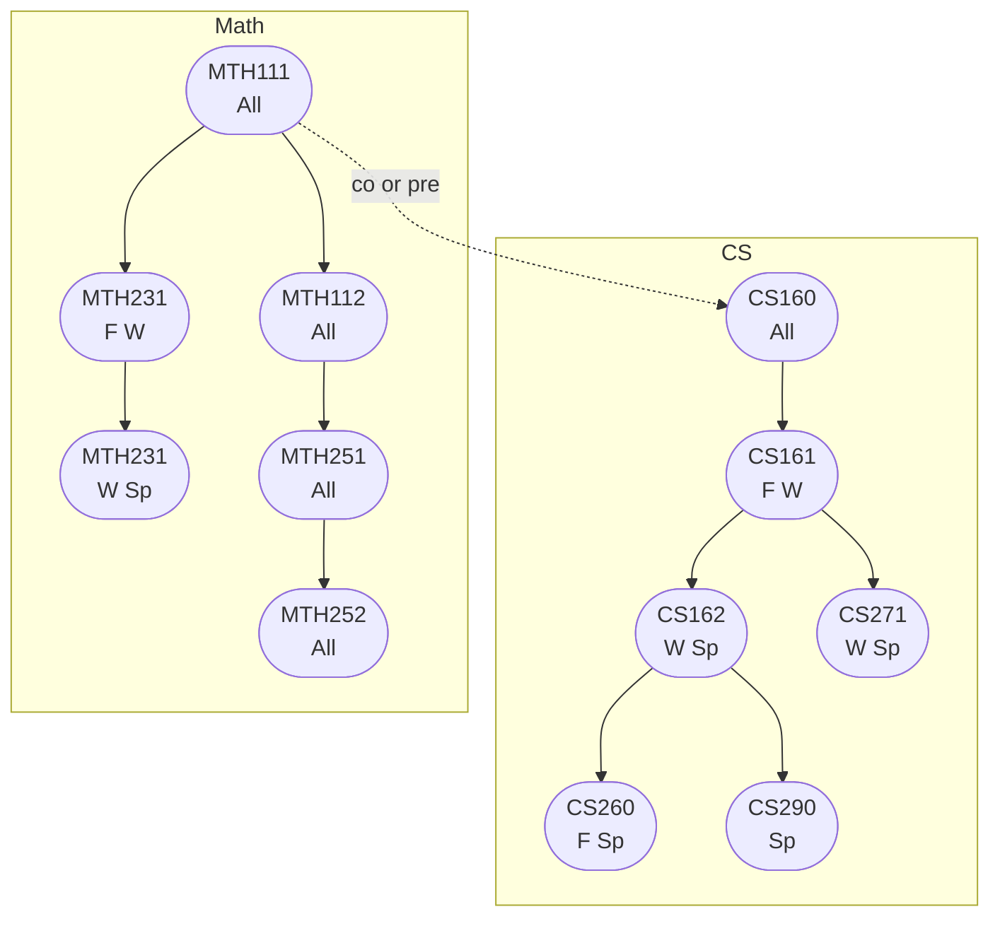

## Online Schedule

CS160 is offered in Spring and Fall online. It may sometimes also available in Winter or summer.

CS161/162/260 are offered online in a sequence that runs Fall/Winter/Spring.

## Ordering

Computer Science and Math courses must be taken in the order shown below:

