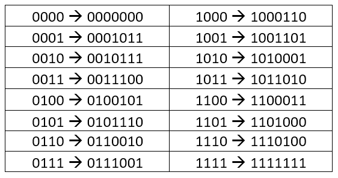
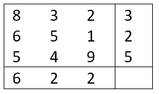

---
# Page metadata.
title: Assignment 5
summary: Architecture, Machine Code, and Errors

layout: single
math: true
---

{}

## Machine Architecture

1. Give a one-two sentence description of each of these components:
    1. ALU
    1. Control unit
    1. ACC (accumulator)
    1. PC (program counter)

1. A computer's main and secondary memory both store information. Why are there two different "memories"?

1. For each step of the machine cycle, give a sentence or two description of what happens:
    1. Fetch: What is fetched? From where to where?
    1. Decode: What information is "decoded"?
    1. Execute: What components might be involved in execution?

## Little Computer

4. 
    1. Translate this machine code to English descriptions:

        | Address   | Value   |
        |-  |-  |
        | 0   | 901   |
        | 1   | 310   |
        | 2   | 901   |
        | 3   | 110   |
        | 4   | 310   |
        | 5   | 110   |
        | 6   | 902   |
        | 7   | 0   |

    1. Call the inputs x and y. Describe the output of the program.
    (What expression does it calculate?) DO NOT list what it does step by step.

1. Write LMC machine code for a program that gets two numbers from input
    (call the first one x and second one y) and outputs the result of calculating 3y - x.
    Given inputs of 3 and 8, the output should be 21.

{}
Hint: you are going to have to store the inputs away in memory so they do not wipe each other out… 
Partial credit available, make sure to submit something, even if you think it has a bug. 
{}

## Error Detection & Correction

6. What is a major flaw of the repetition trick as compared to the redundancy trick?

1. Using the encoding chart shown below for a (7, 4) Hamming code, you get the message
    1110010. How should you interpret the message? **Why?**

    

1. Say we have the message 4 6 7 5
    1. Give the checksum we would get using the last digit of sum checksum (show work)
    1. Give a sequence with two errors that produces the same checksum (show work)
    1. Give the staircase checksum for the original message (show work)
    1. Give the staircase checksum for the erroneous sequence from part b (show work)

1. The table below shows a 9-digit message along with the pinpoint checksums:

    

    1. How can you tell where the error is?

    1. What should the correct message be?

## Programming

Complete Code.org programming lessons for this week. This work will go in your
**Practice** grade.

### Assignment Problems

These are a graded part of this assignment.

10. Give the final value for x after the code has run in each of these samples:
    *(Hint, do them as shown in 5.1.4.18)*

    1. 
            var a = 3;
            var x = a + 5;
    1. 
            var x = 3;  
            var y = 6;  
            y = x;  
            x = y;
    1. 
            var x = 4;  
            x = x + 2;  
    1. 
            var a = 3;  
            var b = 1;  
            var c = 4;  
            c = a + b;  
            a = 7;  
            var x = c * b;

1. Use the starter code in 5.1.5.21 to make your own clicker game. Submit a screenshot
    of your game_screen and the text version of your code. (i.e. you are only submitting
    a picture for "Level 1" regardless of how far you go.)

    Below are some "levels" of achievement on this problem. Feel free to add extra features
    on top of these basics.

    * Level 1: You have customized the graphics and text of the game.
    * Level 2: You make a variable for scores and lives, update the variables in the game
    and update the display on the screen with the current values.
    * Level 3: The game will switch to the win or loss screen when points and lives reach
    some value (you can pick the score that is the goal).
    * Level 4: Restarting the game resets all the counters so the game plays correctly again.
