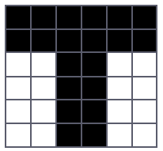
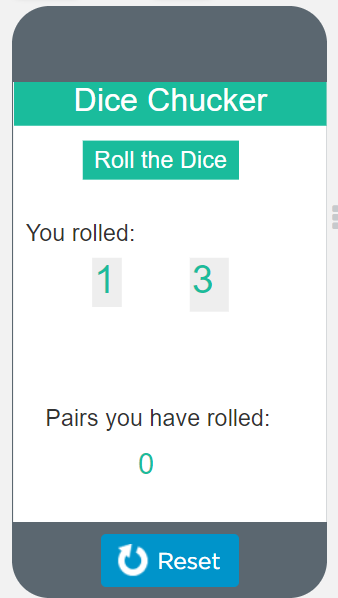

---
# Page metadata.
title: Assignment 6
summary: Programming Languages, Compression, and Strings

layout: single
---

{}

## Little Computer

1. Write a Little Computer program that get an input and then prints 1 if the
input is 100 or more. Print 0 if the input is less than 100. *(See the
assignment sheet for some starter code)*

1. Convert this Little Computer Assembly to machine code:

    | Address   | Machine   Code   | Assembly   |
    |:-:  |:-:  |-  |
    | 0   | ???   | START   INP   |
    | 1   | ???   | STA   X   |
    | 2   | ???   | SUB   SECRET   |
    | 3   | ???   | BRP   EXIT   |
    | 4   | ???   | BRA   START   |
    | 5   | ???   | EXIT   LDA SECRET   |
    | 6   | ???   | OUT   |
    | 7   | ???   | HLT   |
    | 8   | ???   | X   DAT 0   |
    | 9   | ???   | SECRET   DAT 10   |

## Programming Languages

3.  
    1. What are some advantages of a high-level programming language?
    1. What does a compiler do?

1. Pick a programming language. It can be one you have heard of, or one from this list (Java, Python, C, COBOL, FORTRAN, Erlang).

    Research it on the web and answer the following questions:  

    A. What is it primarily used for?  
    B. When was it developed?

    Then provide the code for the Hello World program in that language. You should be able to find the
    code here: http://helloworldcollection.de/

## Compression

5. The image below is a 6x6 area of a fax we are sending. If white squares are 1 and black squares
are 0, we could represent the second row as 000000 and third row as 110011. Assuming we just send
the rows one after each other, we could send those two rows as 000000110011. The whole image would
look like a sequence of 36 1's and 0's

    **Give a run length encoded version of the whole image.** 

    

{}
Note: your answer should not know about "rows" in the image - when you reach the end of one row,
continue to the next.) Please put counts in parentheses for clarity: e.g. (5)1 to indicate 5 1's.
{}

6. Using the "same as earlier trick", reconstruct this string: **QRSTUV-b3c6**

1. Given this frequency for the symbols A, B, C, D, and E:  
    `4A's,  3B's,  2C's, 10D's, 4E's`

    Make a Huffman tree to optimally encode those values and a table showing what code is used
    for each letter. I just want your final tree, I do not need to see all the steps that lead
    to it. *(This is easiest to do on paper and then take a picture and put that in your document.
    Making the shapes in a word processor is a bit fiddly).*

1. What kind of tricks can we use while compressing data like images that we could not use
if we were compressing a large file with the billing records for the college?

## Programming

Complete Code.org programming lessons for this week. This work will go in your
**Practice** grade.

### Assignment Problems

These are a graded part of this assignment.

9. Use AppLab (https://studio.code.org/projects/applab/) to make a program that "chats"
with the user by doing the following:

    * Starts on a screen that has a textbox for the user to type their name and a button that
    says "Enter". The Enter button should take the user to screen 2.

    * Screen 2 should display a message like, "Hi name, nice to meet you" but where name is
    whatever the user entered on screen 1. There should also be a textbox for the user to
    type their favorite movie and another "Enter" button. This button should go to screen 3.

    * Screen 3 should say something like "Oh, movie, I guess that one is OK. My favorite is
    Toy Story." where movie is what the user typed. It should also have a textbox to enter
    their favorite color. And a "Enter" button that goes to screen 4.

    * Screen 4 should should in all caps say something like "I LOVE COLOR TOO!!!!!!! OMG!!!!!"
    where COLOR is what the user typed in all uppercase.

    Provide a screenshot of the first and last screen and the text-based code.

1. Use AppLab (https://studio.code.org/projects/applab/) to make a program that
does the following:

    * Has a button that simulates rolling two dice and shows the result
    (something like the picture shown below).

    * Has a counter that keeps track of how many times you have rolled
    a pair (both dice are same number)

    Provide a screenshot of your program and the text-based code.

    
