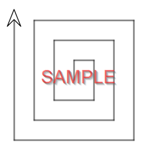

---
# Page metadata.
title: Assignment 1
summary: Computing Fields and History, Indexing, Programming
---

{}

## Computer Fields & Careers

1. A friend is thinking about going into a tech career. In your own words,
use a sentence or two to describe what each educational field would train them to do:  
    1. Computer Science  
    1. Software Engineering  
    1. Computer Engineering  
    1. Information Technology  
    1. Information Systems  

1. Explain what you think Edsger Dijkstra meant by his statement:
*"Computer science is no more about computers than astronomy is about telescopes."*

1. 
    1. Using a job-hunting site (like monster.com or dice.com), find a technology oriented job that
    appeals to you and cut and paste the complete job descriptions & requirements into the answer.
    (Don't worry about reformatting the information; it is fine if the formatting is all jumbled
    after pasting in from the website.)

    1. What program would you start in at Chemeketa to start working towards that job?  
    https://www.chemeketa.edu/programs-classes/program-finder/  
    If you need a four-year degree for the job, what degree program might you transfer to?

## Programming

### Practice

Complete the programming tutorials that were assigned this week. This work will go in your
**Practice** grade.

{}
You will not recieve credit for this work if your username in Code.org is not set to your
my.chemeketa username - if you are bsmith12@my.chemeketa.edu your Code.org name should be
bsmith12.
{}

### Assignment Problems

These are a graded part of your assignment:

4. Using the work area for 3.4.3 (the first square problem), write code to make this pattern:  

    

    Copy and paste the **text version of your code** and a **screenshot of your drawing** into the assignment.
    You will need to hit the **Show Text** button to get the text version of your code that you can
    copy and paste:  

    

    To find out how to take a screenshot of just a part of your screen, google
    *"Windows region screenshot"* or *"Mac region screenshot"*.
    I do NOT want screenshot of your entire screen - just the drawing.

{}
Once you have received credit for a lesson in Code.org, you can't lose it. So don't worry about messing
up your code for 3.4.3. You can always use the **Version History** button to see your old code.
{}

## Computer History

5. Why was the idea of a **Stored Program** a critical milestone in the development of computers?

1. For each of the four generations of computers, list the key technology used to build
the computers of that generation.

## Algorithm – Indexing

7. Build a page-word index (like the one shown in the reading or in Q8) for the words
*"student"*, *"computer"*, and *"monitors"* on the three pages shown below.  
    *Ignore capitalization and punctuation. Treat "Word", "word", and "word." as all the same.*

    **Page 1**

    >High schools often use hall monitors to make sure every student stays in class.

    **Page 2**

    >Computer monitors come in various sizes. Once very expensive, 20+ inch monitors are now common.

    **Page 3**

    >It is now often an expectation that every student has access to a computer.

1. Below is an index for a set of pages (NOT the same three pages shown above):

    | Word | Index |
    | --- | --- |
    | A | 1-2  1-8  1-12  2-8  3-15 |
    | bit | 1-7  2-10 |
    | computer | 1-6 1-19 2-16  3-4 |
    | dog | 2-2  2-9  3-16 |
    | man | 1-3  3-2 3-11 |
    | &lt;titlestart> | 1-1  2-1  3-1 |
    | &lt;titleStart> | 1-4  2-6  3-5 |
    | &lt;bodyStart> | 1-5  2-7  3-6 |
    | &lt;bodyEnd> | 1-20  2-17  3-18 |

    Use it to answer these questions:

    1. What page would likely be the best match for a query about **"man"**? Why?

    1. What page(s) would be a match for the phrase **"dog bit"**? How do you know?

    1. What page(s) have the word **"A"** in the title? How do you know?

1. If the index contained pages only (as shown below), what is something we would
no longer be able to use it to do?

    | Word | Index |
    | --- | --- |
    | A | 1 2 3 |
    | bit | 1 2|
    | ... | ... |
