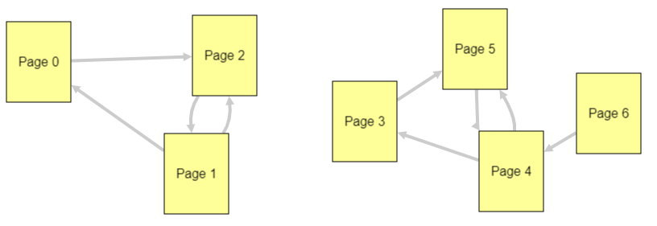
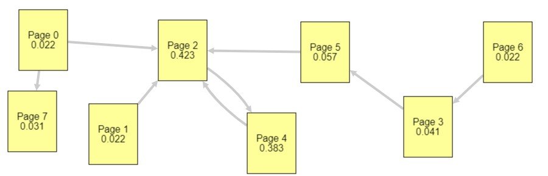
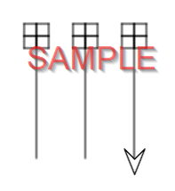

---
# Page metadata.
title: Assignment 2
summary: Binary, Functions, PageRank

layout: single
weight: 20
---

{}

## Binary And Bits

1. What does the picture below show? Make sure to specify what the red line, gray line and dotted
line represent, how they are related, and why the red/gray line are different.
    

2. Computers sometimes use electricity on a wire to represent a bit of information.
What is another physical method computers sometimes use to store/represent a bit of information?

3. How many **bits** (not bytes!!!) are in 5 kilobytes? (Show the work used to calculate)

## Binary Number Representation

4. 
    1. What is the smallest number of bits that can be used to represent the decimal value 50 in binary?
    2. What is the largest numeric value (in decimal) that you can represent with 15 bits?

5. Convert the decimal number 38 to its binary equivalent using the "divsion by two" method from
Chapter 4.3 of CS160 Reader.  Show the work that does the conversion.  

## Page Rank Algorithm

6. In the diagram below, focus on just pages 0, 1, and 2. Which page would have
the lowest authority (popularity)? Explain why.
    

1. In the diagram below, after the random surfer from the page rank algorithm
reaches Page 7, how does it get to other pages?
    

1. In the diagram above, Pages 0, 1, and 5 all contribute to the authority of page 2.
Which contributes the most? Which contributes the least? Briefly explain.

## Programming

Complete Code.org programming lessons for this week. This work will go in your
**Practice** grade.

### Assignment Problems
These are a graded part of this assignment. You should paste a screenshot of the drawing
your program makes into the answer document along with the text for your code (NOT a
screenshot of the code).

To find out how to take a screenshot of just a part of your screen, google
*"Windows region screenshot"* or *"Mac region screenshot"*.
I do NOT want screenshot of your entire screen - just the drawing.

9. Use Lesson 3.6.2's or 3's work area to write code to draw the picture shown below.
(The exact spacing isn't critical, but it should look pretty close to this picture.)

    
    
    Paste in a screenshot of your drawing and the complete text version of your code. Your score depends not
    only on making the correct shape, but on using multiple functions that call each other with
    descriptive names.

    Here are some "levels" of achievement. Higher levels represent a better program. (You only
    need to submit one program. The levels are just tips to evaluate how well done your
    program is.)
    
    * Level 1 : Draws most of the shape, has at least one function.
    * Level 2 : Draws shape. Has at least two functions that have meaningful names
    * Level 3 : Draws shape. Has at least two well named functions, layered so that at least one
    function calls other function(s)
    * Level 4 : Draws shape. Has well-named, layered functions. Each function is a reasonable
    length and does one clear job.  
    *A function probably shouldn't be much more than 10 lines of code. Anything much longer should be broken into sub-tasks handled by other functions.*

10. From Lesson 3.7.10 paste in the screenshot of the picture your program drew and the text version code you used to do it.
