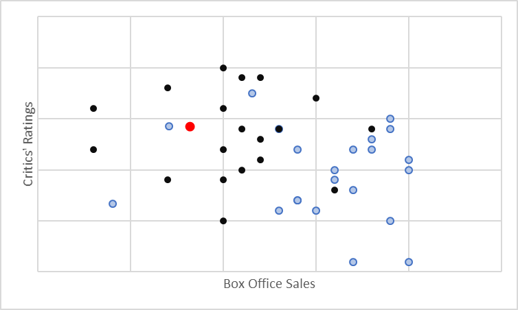
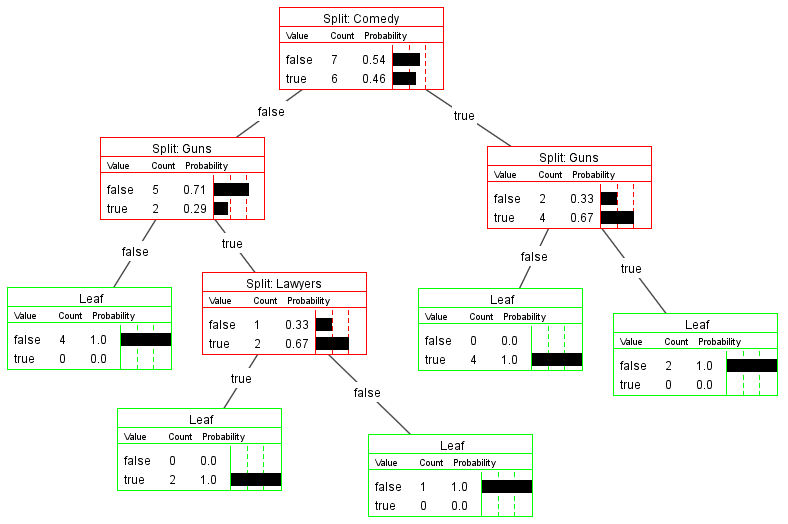
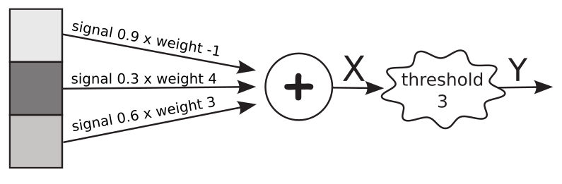

---
# Page metadata.
title: Assignment 8
summary: Algorithmic Efficiency, Pattern Recognition, and Loops

layout: single
weight: 80
---

{}

## Algorithmic Efficiency

1.  Give the number of comparisons required to search a list with a length of 600,000 items.
    Show the formula you are using in addition to your answer.
    
    1. Using linear search average case:
    
    1. Using linear search worst case:
    
    1. Using binary search worst case:

1.  Open this link:  
    https://studio.code.org/projects/applab/An2pvrfTUZZ2lwSNKT2kqA 

    Then click the **View Code** button. Then click **Remix** to make your own copy (otherwise you can't
    change my code).

    Time functions D and E each with the input sizes: 5, 10, 15, and 20. After running the
    different inputs on each function, describe the growth pattern of each as **Constant,
    Linear or Quadratic**. (Functions A-C you should have already looked at as practice
    on the Algorithm Efficiency worksheet this week. See that document for more detailed instructions.)

1. Use the given information to estimate the time taken. **Show work.**
    Hint: to show a fraction you can use Google Doc's equation tool or just write something
    like 100 / (2 + 3)

    1. It takes 0.0002 seconds to find an item in a list of 3,000,000 items with binary search.
    Estimate the time linear search would take.

    1. It takes 4.1 seconds to sort a list of 500,000 items using selection sort.
    Estimate the time to do the same sort on 1,200,000 items.

## Pattern Recognition

4. The diagram below shows data points representing a number of movies. The blue dots are
    studio movies and the black dots independent movies. The red dot is a movie we for which we
    are trying to decide "Is it a studio movie or an independent film"?

    1. What would the Nearest Neighbor algorithm classify the movie as?
    
    1. What would a K-Nearest-Neighbor (using K of 3 or 5) classify the movie as?
    
    1. In general, what is the logic for choosing to use K nearest neighbors instead of just 1? 

    

1. The decision tree below is based on characteristics of a TV show: "Is it a comedy?",
    "Does it have guns"?, "Does it have lawyers?". We can use it to predict whether a person
    will like a new show (If so, we should feature it for them in their "recommended for you"
    list). The numbers in the decision tree are based on training the decision tree with 13
    existing shows that we know the person likes ("true") or does not like ("false").

    
  
    1. According to the decision tree, what is the most important question to answer
    while figuring out if a show will be liked?

    1. A particular show is a comedy and does NOT have guns. Would knowing if it involves
    lawyers help us make a better prediction about the show? Why?

    1. All we know is that a show is a comedy. Should we predict it will be **liked** or
    **not liked**? Why?

1. In the neural network below, inputs to the system are shown in the boxes and ovals are
    neurons labeled with their thresholds. **Assume each neuron uses a simple comparison
    of inputs to threshold and outputs only a 0 or 1**.

    

    1. What would the input to the neuron be (value at X)?  Show work.

    1. Approximately value would you expect Y to have? Why?

1. How do the weights in a neural network like this get set?

## Programming

Complete Code.org programming lessons for this week. This work will go in your
**Practice** grade.

### Assignment Problems

These are a graded part of this assignment.

8. Use applab (https://code.org/educate/applab) to make a program that asks the user
    (using the prompt block shown below) for a number between 1 and 100. Then generate
    random numbers between 1 and 100 and print them out until the number is greater
    than the user's input was.

    

1. Use applab (https://code.org/educate/applab) to write a program that prints out counting from
    300 to 0 by 25's. Like:
    300  
    275  
    250  
    …

    Provide the text based code.

1. Use https://code.org/educate/applab to make a simulation that does the following:
    * Level 1: Rolls two dice (picks two random numbers between 1 and 6), stores the
    values into variables, and prints them.
    * Level 2: Keeps rolling dice until you get a pair (both dice are the same).
    * Level 3: Rolls the two dice until you get 5 pairs.
    * Level 4: Prints out the number of rolls it took to get 5 pairs.

    You do not have to make a user interface for the program.

    This is a multi-level problem. Level 3 is full credit, lower levels are partial. Submit the
    text code for ONLY the highest level you got to. (Example: If submitting level 3, you do not
    need to show 1 and 2). You are better off submitting something that is correct from a lower
    level than a very broken version of a higher level.
