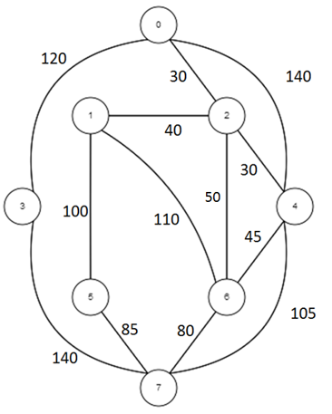
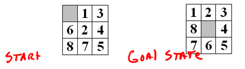

---
# Page metadata.
title: Assignment 7
summary: Searching and Sorting, AI Search, 

layout: single
weight: 70
---

{}

## Searching and Sorting

1.  
    1. What is a disadvantage of linear search (compared to binary search)?
    1. What might force you to use it instead of binary search?

1. Show the work needed to find 19 in this list using **binary search**:

    | Index |     1      |     2      |     3      |     4      |     5      |     6      |     7      |     8      |     9      |     10      |
    |-  |-  |-  |-  |-  |-  |-  |-  |-  |-  |-  |
    | Value |     2      |     8      |     12      |     19      |     34      |     35      |     42      |     48      |     49      |     50      |

1.  
    1. Do an **insertion sort** on this list. Show the state of the list after each step of the algorithm.
        *(After one more item has been inserted into the sorted portion).* Make sure you are faithfully
        following the algorithm.

        5  3  9  8  4  2  6  7  
    
    1. Do a **selection sort** on this list. Show the state of the list after each step of the algorithm.
        *(After one more item has been inserted into the sorted portion).* Make sure you are faithfully
        following the algorithm. 
        
        5  3  9  8  4  2  6  7

## AI Search

{}
For both problems in this section, most of the points are for the WORK, not just figuring
out the correct answer.
{}

4. In the map below, assume that the numbers by each line are minutes it would take to travel from
one location to another. **Show a search tree that shows how to find the best path from location 1
to location 3.** *(Easiest to do by hand and paste in a picture/scan)*

    

1. Show a search to find the steps required to transform the eight-puzzle below into its solution state.
Show the search required to solve it – and the heuristic "cost" of each state, NOT JUST the correct sequence.
You may omit duplicate states (OK to not redraw a state you have already seen).
*(Easiest to do by hand and paste in a picture/scan)*

    

## Programming

Complete Code.org programming lessons for this week. This work will go in your
**Practice** grade.

### Assignment Problems

These are a graded part of this assignment.

6. Use this link to load starter code for a dice game:
    https://studio.code.org/projects/applab/Y4DTqNTHM4Kz_z5bp1mXdL3a0EIEN4qYXPCcBTcog6I
    
    Click the **View Code** button then the **Remix** button to make your own copy.
    
    Add code to the game to set the `label_ScoreValue` to show a score after the user clicks the
    **Roll Dice** button. Here is how to calculate the score from the three dice
    (`label_die1`, `label_die2`, `label_die3`):
    
    * All three dice show the same value:  **50**
    * Two (but not 3) of the dice show the same value:  **25**
    * No dice have the same value:  **sum of the three dice**
    
    You can use if…else, &&, and || to make this work. There are many possible ways to do the work,
    if your first approach seems to be getting too confusing to implement, try a different approach.
    
    Hint: to test your code, you will probably want to cheat by changing the random numbers to not
    be random. If I wanted to force the three dice to have the values 3, 3, 2, I could do this:
          setText("label_die1", randomNumber(3, 3));
          setText("label_die2", randomNumber(3, 3));
          setText("label_die3", randomNumber(2, 2));

{}
You probably want to use getNumber on the labels when you try to read the values of them, not getText.
{}

7. This is a multi-level problem. Level 5 is full credit, lower levels are partial. Submit your text
    code for ONLY the highest level you got to. (Example: If submitting level 3, you do not need to
    show 1 and 2). You are better off submitting something that is correct from a lower level than
    a very broken version of a higher level.
    
    * Level 1: Make the color sleuth app pick random colors. (5.1.10.11)
    * Level 2: Add code to identify correct picks. (5.1.10.15)
    * Level 3: Add code to identify whose turn it is. (5.1.10.18) 
    * Level 4: Add scoring. (5.1.10.21) 
    * Level 5: Add winning and losing based on some goal (first to 10 or something else you chose) (5.1.10.23)
    