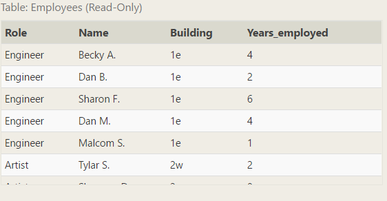
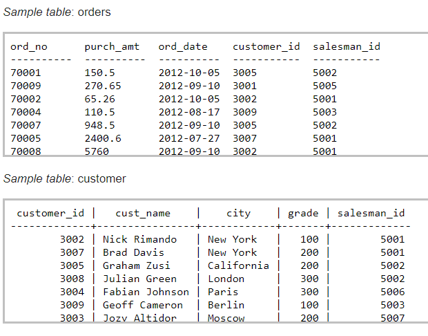

---
# Page metadata.
title: Assignment 9
summary: Operating Systems, Parallel Processing, Databases

layout: single
weight: 90
---

{}

## Algorithmic Efficiency

1. For each of the items below, describe in one or two sentences how the operating system provides
either **allocation** or **abstraction** of the resource:
    1. **Allocation** of Processors:

    1. **Abstraction** of Hard Drive:

    1. **Abstraction** of Memory:

## Parallel Processing

2. According to Moore's Law, how many times more powerful should computers be in 30 years? Show work.

1. For a given task, 75% of the work can be done in parallel. How many times faster could we get\
the work done with:
    1. 2 workers?
    1. 5 workers?
    1. 500 workers?

    Show work.

1. The two programs shown below are running at the same time. Each program is three instructions
long. The instructions are labeled something like A1 or B3.  

    When they start, the value of "Joe's
    money" in the database is 500. Give an **ordering** for the instructions
    that would produce a final balance of 600.  
    *(An ordering would look like: A1, A2, B1… and must have all six instructions. The instructions from
    A must remain in the correct order - A1 must be before A2. So must the instructions from B.)*

    <table>
    <tr><th>Program A</th><th>Program B</th></tr>
    <tr><td>
    A1) Ask database for Joe's money, store answer in x 
    A2) x = x + 100 
    A3) Tell database to set Joe's money to x 
    </td>
    <td>
    B1) Ask database for Joe's money, store answer in y 
    B2) y = y + 50 
    B3) Tell database to set Joe's money to y 
    </td></tr>
    </table>

### Databases and SQL

5.  Here is a table with information about the products someone is buying:

    | Name | Quanitity | UnitPrice   |
    |-  |-  |-  |
    | Widget | 900 | 1.25   |
    | Gizmoe | 500 | 0.25   |
    | ... | ... | ...  |

    And a ToDo list transaction to update the order (the price will drop once they order
over 1000 widgets):

        Start transaction
        Add 200 to Widget Quantity
        Change Widget UnitPrice to 1.15
        End transaction

    1. Why are the actions not idempotent?

    1. Rewrite the todo list so that the actions are idempotent.

1. Why might a database need to undo part of a transaction?  
*Looking for a technical reason, not "Because someone changed their mind"*

The next few questions are based on the Employees table shown below. You can use the practice
area on this webpage to experiment with the table: https://sqlbolt.com/lesson/select_queries_with_outer_joins 
The actual exercises on that web page are different (and you do not need to be able to do them),
but you can use the practice area to test your work.

**For questions 7 and 8, your answer should be the query used to get data, NOT the data the query produces.**

7. Write a query that produces the Name and Role for each employee with 5 or more years service.

8. Write a query that produces all the fields (columns) for the first 4 employees when sorted
alphabetically by name.

9. According to the data tables shown below: 
    1. How much has Graham Zusi ordered?
    1. Explain your logic for A

    

## Programming

Complete Code.org programming lessons for this week. This work will go in your
**Practice** grade.

### Assignment Problems

These are a graded part of this assignment.

10. Given this array:

        var colors = ["red","orange","yellow","green","blue","indigo","violet"];

    1. Write one line of code that would remove "green" (the 4th item) from colors.
    (Not OK to just assign the right final value to the array - you must remove the word that is there.)

    1. Write one line of code that would turn the first item ("red") into "gold".
    (Not OK to just assign the right final value to the array - you must change just that one
    piece of data that is there.)

    1. Write one line of code that would print the next to the last thing in the list (currently "indigo").
    Your line of code should still print the next to the last thing even if the list changes.
    i.e. If we removed "violet" before running your code, it should print "blue"
