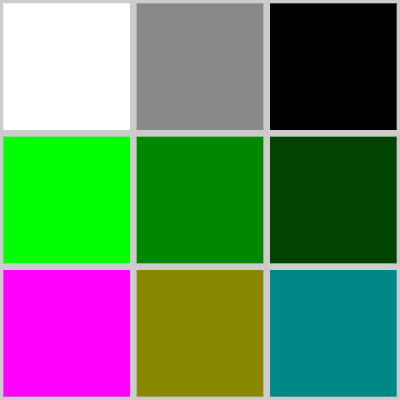

---
# Page metadata.
title: Assignment 3
summary: Data Representation, Cryptography, Loops

layout: single
math: true
weight: 30
---

{}

## Binary Math

1. Complete the following two binary addition problems. Show work (carries).

    A.

         1110
        +0010

    B.

         0010
        +1010

    C. Which problem(s) have overflow? None, A, B, or Both?

1. Convert the following hexadecimal integers to their decimal equivalents.  Show work.
    1. 3F
    1. AC

1. Convert the following **binary** integers to their equivalents in the **hexadecimal** number system:

    1. 00001100
    1. 00111111

## Data Representation

4. What are these bits as ASCII characters? `01000101 01101100 01100110`

1. How many bits would be required to store a 300 x 800 image with 32 possible colors per pixel?
Show the math you used to get your answer.

1. Use [this code.org widget](https://studio.code.org/s/pixelation/stage/5/puzzle/1) to
    make an image that looks like the picture below. You don't have to figure EXACTLY the same
    bits/hex that I used, but the colors should be close. (The top row starts with pure white
    and gets darker, the middle row pure green and gets darker, the bottom row has magenta/pink; dark yellow; dark cyan)

    

    Use **24 bits per pixel** to specify the colors. For your answer, provide a
    screenshot of the webpage that shows both the picture
    and the binary or hex you used to make it.

    This video shows how to use the widget:

    

## Private Key Cryptography

7. Using clock arithmetic with a **clock size of 7**, what answer would we get for
the following expressions?
    1. 12 (i.e. what is `12 mod 7`)
    2. 21
    3. 6
    4. $3^4$

1. Part of what makes clock arithmetic useful as for encryption is that in an equation, there
can be an infinite number of values for a variable that produce the same answer.
Give two different integer values for x that are solutions for this equation:

    3x = 4 (clock size 5)  
    *(Could also be written as `3x mod 5 = 4`)*

1. Assume you and Arnold are using the Diffie-Hellman algorithm.
You agree on a base of 13 and a clock size of 19.
You choose 4 as your private number, Arnold chooses 5.

    1. What is your public-private number? Show work

    1. What is Arnold's private-public number? Show work

    1. What is your shared-secret number? Show that you and Arnold get the same number.

## Programming

Complete Code.org programming lessons for this week. This work will go in your
**Practice** grade.

### Assignment Problems

These are a graded part of this assignment.

10. From 3.8, submit a screenshot and your code for the highest level you got working correctly.
 (It is better to submit a working "Level 2" than a broken attempt at "Level 4".)

    * Level 1 : 3.1.8.10 - Basic sea drawing
    * Level 2 : 3.1.8.13 - Has functions with parameters for drawStarfish, drawSeagrass and drawFish
    * Level 3 : 3.1.8.14 - Has a drawFish function with four parameters
    * Level 4 : 3.1.8.15 - Creates a random scene

1. Go to lesson 3.1.9.15 in Code.org. Do not worry about what it asks you to do.
Delete all the existing code (easiest to do in text mode), then paste in this starter code:

        //Your code here
        
        //Do not modify this
        function drawSquare(size) {
          for (var i = 0; i < 4; i++) {
            moveForward(size);
            turnLeft(90);
          }
        }

    Add code to draw 200 squares of random colors and sizes to produce a picture that looks
    like the one below. (It won't be exactly the same because we are using randomness).
    Provide a screenshot of the picture your program draws and the text version of your code.

    Levels of credit: (Only submit one "level" - the highest you get working.)

    * Level 1: Draw 200 squares in different locations - but there are lines between each
    * Level 2: Draw 200 squares - no lines connecting them
    * Level 3: Draw 200 squares of random sizes
    * Level 4: Draw 200 squares of random sizes, each square is a random color  
     
    
