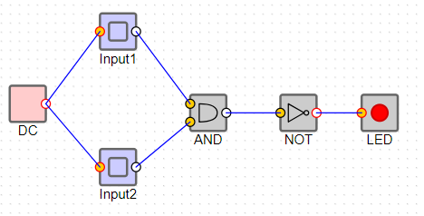
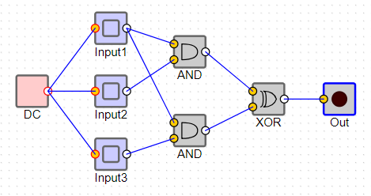

---
# Page metadata.
title: Assignment 4
summary: Circuits, Asymmetric Cryptography

layout: single
math: true
weight: 40
---

{}

## Binary Math

1. Which logic rule does each statement describe? (Which ONE logic rule is best described by the statement)
    1. Turn on if one, but not both of the inputs are on
    1. Turn on if at least one input is on
    1. Turn on if both inputs are on

1. How should we set the inputs in this circuit to force the Output to be Off? Explain your answer
by describing the values that will come into each gate and the value it will output.
    

1. Fill in a truth table for the circuit below:
    

## Asymmetric Cryptography

4. Someone sends you a message of "15". They also send you a copy of their message encrypted with
their private key. The "signed", or encrypted copy is "71". Their public key is
**(exponent 13, clock 77)**. Show how to authenticate if the message is from them. 

1. Briefly and clearly summarize (1-3 sentences) how public/private key cryptography can
guarantee each of the following. Make sure to include the phrases **public key** and 
**private key** in each answer and specify who uses which key.  
    ***Do not worry about how we trust the keys, just focus on how we can use keys
that are already have and trust.***

    1. I can download a program from Microsoft and make sure it actually came from them.

    1. I can send a message to Bank of America and be sure only they can read it.

1. I start banking with a new bank (Wells Fargo). They send me their public key.
    1. How does a certificate authority help my computer know it can trust the public key?
    1. Why can my computer trust the certificate authority?

## Programming

Complete Code.org programming lessons for this week. This work will go in your
**Practice** grade.

### Assignment Problems

These are a graded part of this assignment.

7. Take your code from 5.1.1.7 (the one with two buttons: go forward and turn left). Add to it
another button **Star**. Implement code so that if you press the **Star** button, the turtle
should draw a small 5-pointed star. In your document, provide:
    * A screenshot of the running program showing the new button and the turtle having drawn a star.
    * The text version of your code

1. Use AppLab - [https://studio.code.org/projects/applab/](https://studio.code.org/projects/applab/) -
to make a new project. Make an app that:
    * Asks a multiple choice question (3 or more choices) question on the first screen
    (like a single question quiz)
    * Has buttons for the possible answers
    * Clicking the correct answer should take the user to a new screen that displays a
    congratulations message
    * Clicking the wrong answer should take the user to a screen that tells them to try
    again and has a button to go back to the first screen

    Provide screenshots of EACH screen you make and the text version of your code. 
    Here are some "levels" of achievement on this problem:

    * Level 1: Screen with question and multiple buttons
    * Level 2: One button is correct and takes you to a second congratulations screen
    * Level 3: All the other buttons take you to a "try again" screen
    * Level 4: Try again screen has button that takes you back to the question

{}
AppLab has a lot of functions we have not learned about yet, you can ignore those.
Just focus on using the ones you have learned about.
{}
