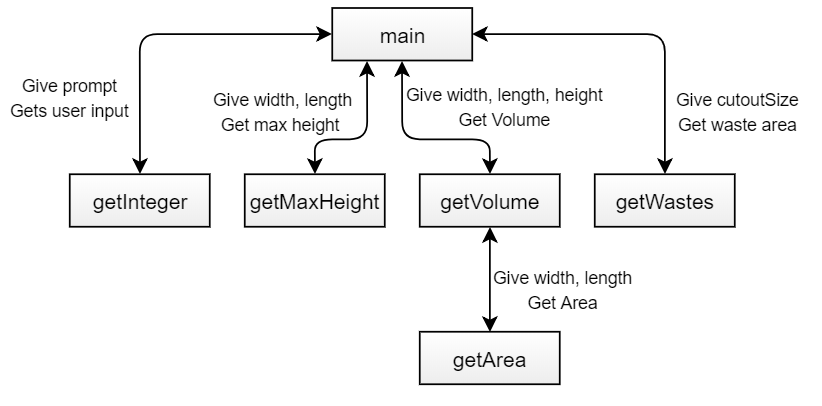

{}

## Objective

Upon completion of this assignment the student will be able to write
programs that use functions to decompose a problem.

## Background

You will be writing a program that calculates information about the
boxes that can be made from a sheet of cardboard. Say we have a sheet of
cardboard that has a width of $y$ and a length of $z$. We can make cuts
of size $x$ as shown below in the leftmost picture, then fold the sides
up to make a box with the dimensions $y - 2x$ by $z - 2x$ by $x$.


## Part A: 80% Function Building

Build the following functions. They are tools that will help us write a
program for calculating information about the boxes that can be made
from a sheet of cardboard. You will not actually worry about writing the
full program until you get to Part B of the assignment.

You should **declare** the functions in `boxFunctions.h`,
**implement** the functions in `boxFunctions.cpp` and use the `main`
function in `assign6.cpp` to **call** the functions and demonstrate
that they work.

{}
For this part of the assignment, you are not trying to
show a fully working program, just tests that demonstrate the functions
described below are implemented and working.
{}

Each function needs at least one test. Many will require more than one.
For example, you should make sure the `getMaxHeight` function works
correctly with boxes that are wider than they are long and vice versa.

Here is what two tests of getMaxHeight might look like:

```
int result1 = getMaxHeight(6, 8);
cout << " getMaxHeight(6, 8) is " << result1 << endl;
```

```
int result2 = getMaxHeight(8, 6);
cout << " getMaxHeight(8, 6) is " << result2 << endl;
```

Figuring out what tests to run is part of the challenge of this assignment.
Make sure to think through the different inputs a function might get
and what might cause issues.

Each function must be preceded by a doxygen comment with a brief
description of the function overall, and descriptions of its parameters
and return value. The functions you must build and test are:

* `int getInteger(const string& prompt)`

  Prints the given prompt, gets console input from user and returns the
  value input. If the user enters bad input, the function should
  re-prompt the user and get new input until an integer is entered.
  The appendix below has a sample of a loop that reads until
  valid input is provided.

* `int getMaxHeight(int width, int length)`

  For a given width and length, returns the maximum height (whole
  number) that results in a valid box (all dimensions greater than 0).

* `int getArea(int width, int length)`

  For a given width and length, return area of the corresponding
  rectangle.

* `int getVolume(int width, int length, int height)`

  For a given width, length and height, return volume of corresponding
  box. This *must* use `getArea` as a helper for full credit.

* `int getWaste(int cutoutSize)`

  For a given size cutout ($x$), return the total waste produced (total
  area cut out at the corners). For example, `getWaste(3)` should return 36.

## Part B: 20% Final Program

Comment out the testing code you wrote in the main function. Leave it
there in comments; do not delete it, because your part A grade includes
that testing code. Use the functions you developed in part A to solve
part B; a program that has the right output but does not use those
functions will receive minimal credit.

Write a program that reads in the width $y$ and length $z$ of a sheet
of cardboard and prints out for every possible integer height $x$, the
volume of the resulting box and how many square inches of cardboard are
wasted by the cutouts.

{}
Enter sheet width: `10`
Enter sheet length: `8`

Possible boxes:

  Height   Width   Length   Volume   Waste Area
  \-\-\-\-\-\-\-\- \-\-\-\-\-\-\- \-\-\-\-\-\-\-\- \-\-\-\-\-\-\-\- \-\-\-\-\-\-\-\-\-\-\-\-
  1        8       6        48       4
  2        6       4        48       16
  3        4       2        24       36
{}

{}
It stops after 3 in this example because that is the maximum height we
can make with a 10-by-8 sheet.
{}

Here is a visual representation of how the functions relate to each
other in the final program. Note that some functions will need to be
called more than once.



### Submit files

* `boxFunctions.h`
* `boxFunctions.cpp`
* `assign6.cpp`

{}
Recall that the `.h` file isn't compiled, it just gets `#include`d.
However, it must be present for the `.cpp` files to compile.
{}

## Appendix

To detect bad console input and get rid of it until the user enters
something useful you need to do something like:

```
int x;
cout << "Enter a number:";
cin >> x;

// If at first you don't succeed...
while (cin.fail()) {
  cin.clear(); // Clear any errors so cin starts working.
  cin.ignore(INT_MAX, '\n'); // Flush any existing (bad) input.

  // ...try, try again.
  cout << "Enter a number:";
  cin >> x;
}

// Now x has valid input.
```
