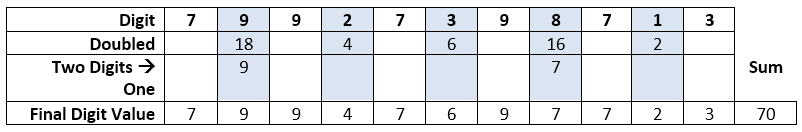
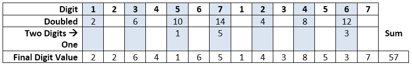
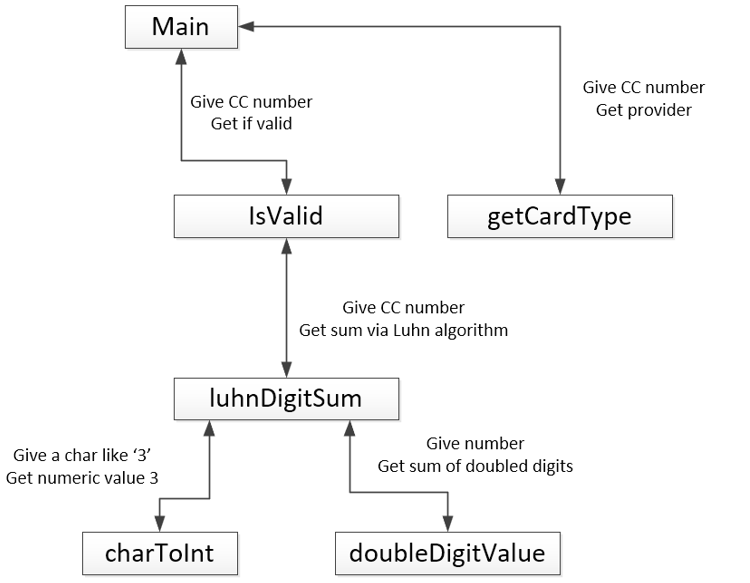

{}

## Objective

Upon completion of this assignment the student will be able to write
programs that use functions to decompose a problem.

## Background

The last digit of a credit card number is always chosen to provide a checksum of the other digits.
(The scheme used is called the Luhn algorithm: http://en.wikipedia.org/wiki/Luhn_algorithm).
If one digit in a credit card is changed, or they are typed in the wrong order, the checksum
should detect the data entry mistake.

To check a credit card number, you need to:

* Working your way from RIGHT to LEFT add up the digits. The first, third, fifth, etc... digits
use as is. For the second, fourth, sixth, etc... digit do the following:
  * Double the number (i.e. 4 --> 8,  6 --> 12)
  * If the number ends up being two digits, add the two digits (i.e. 12 --> 1 + 2 --> 3)
  and use that as the final value for the digit.
* If the total is evenly divisible by 10, the number is valid. If not, the number is invalid.

### Examples of the process

Given the number "79927398713", we would start on the right with the 3 - since it is the first digit
it would not be doubled. The next digit is 1 - since it is second it would be doubled to make 2.
Next is 7 and it is not doubled (since it is third). Then is 8 and it is doubled which makes 16; because
16 is no longer one digit, we would turn it into 7 (1 + 6)...



The sum of all the final digit values is 70, which is divisible by 10. So that is possibly
a valid credit card.

-------------------------------

Given the number "12345671234567", we would start on the right with the 7 - it would not be doubled.
The next digit is 6 - it is doubled, which makes 12 and since that is two digits we turn it into 3
(1 + 2)...



This time, the sum of the final digit values is 57, which is not divisible by 10 and thus
NOT a possible credit card number.

## Submission

Submit the following files:

* `cardFunctions.h`
* `cardFunctions.cpp`
* `assign6.cpp`  (has the main function)

*I should be able to compile and run your program with:*

    g++ -std=c++11 cardFunctions.cpp assign6.cpp -o program.exe
    program.exe       (./program.exe on a mac)

{}
Test building and running from the command prompt. It is possible to have something set up
in QTCreator that works there but does not work when I compile your code using the
commands shown above.

NEVER include a .cpp file in another .cpp file.
{}

## Part A: Function Building (~85% of grade)

Build the following functions. They are tools that will help us write a program for checking
a credit card number. You will not actually worry about writing the full program until you
get to Part B of the assignment.

You should **declare** the functions in `cardFunctions.h`,
**implement** the functions in `cardFunctions.cpp` and use the `main`
function in `assign6.cpp` to **call** the functions and demonstrate
that they work.

{}
For this part of the assignment, you are not trying to
show a fully working program, just tests that demonstrate the functions
described below are implemented and working.
{}

Each function needs at least one test. Many will require more than one.
For example, you should make sure the `doubledDigitValue ` behaves differently
with values less than 5 than it does with values of 5 or greater - make sure
to show that it works for both cases! Here are what those tests might look like:

```
int result1 = doubledDigitValue(6);
cout << "doubledDigitValue(6) is " << result1 << endl; 
int result2 = doubledDigitValue(3);
cout << "doubledDigitValue(3) is " << result2 << endl;
```

Figuring out what tests to run is part of the challenge of this assignment.
Make sure to think through the different inputs a function might get
and what might cause issues.

Each function **must** be preceded by a doxygen comment with a brief
description of the function overall, and descriptions of its parameters
and return value.

The functions you must build and test are:

### int charToInt(char digit)

Turns a char like '3' into the number it represents (3).

*Behavior is undefined for chars that do not representing digits. (Your code does not have to
worry about them).*

### int doubledDigitValue(int number)

Take a number doubles it. If the number is still a single digit, that value is returned.
If the doubled value is two digits long, returns the sum of those digits.

Examples: Calling doubledDigitValue(4) should give 8. Calling doubledDigitValue(8) should give 7.  
*Behavior is undefined for numbers above 9. (Your code does not have to worry about them).*

### string getCardType(const string& cardNumber)

Returns a string representing the type of credit card a number is: Visa, MasterCard,
American Express, or Unknown.

*Behavior is undefined for strings of length < 2. (Your code does not have to worry about them).*

### int luhnDigitSum(const string& cardNumber)

Sums the digits of a credit card number according to the Luhn algorithm. i.e.
Calling sumOfDigits("79927398713") should result in 70.

For full credit this function should make use of charToInt and doubledDigitValue instead
of duplicating their code.

### bool isValid(const string& cardNumber)

Returns true/false indicating if a credit card number is potentially a valid number
according to the Luhn algorithm.

This should use a call to luhnDigitSum and not reimplement the logic of that function.

## Part B: Main Program (~15% of grade)

Comment out the testing code you wrote in the main function. Leave it
there in comments; do not delete it, because your part A grade includes
that testing code. Use the functions you developed in part A to solve
part B; a program that has the right output but does not use those
functions will receive minimal credit.

Write a program that reads in a string representing a credit card number.
It should then print out if the number is valid and what kind of card it is. 

### Sample Run 1
{}
Enter card number: `79927398713`
Valid number, unknown issuer
{}

### Sample Run 2
{}
Enter card number: `43214321`
Not Valid, Visa
{}

Here is a visual representation of how the functions relate to each
other in the final program. Note that some functions will need to be
called more than once.


