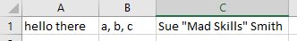

{}

## Objective

Upon completion of this assignment the student will be able to represent
a simple database using an array of structs.

## Background

Your program should read data from a text file into an array of
structs and then do some interesting work with the data. It should *not*
require any user input. All output should be clearly labeled.

You can use any data set you want as long as it has at least 100
records and each record consists of at least 4 fields. Here are some
sample data sets for you to use:

* [Google Play store app data](googleplaystore.csv)
* [NFL passing data](NFL_Career_Stats_Passing.csv)
* [Oregon state employee salaries](OR_Salaries__State_Agencies__As_of_June_30__2014.csv)
* [Portland crime data](portland_crime_incident_data2017.csv)

The provided files (and many others you might find) are in .csv
format. That is a plain text file that uses commas to separate parts of
each record. See the appendix at the end of this document for tips on
working with .csv files. It is perfectly acceptable (and a really good
idea) to \"clean up\" the data file by hand to make it easier to
read—again, see the appendix for details.

Here are some spots to look for other data sets:

* <https://www.kaggle.com/datasets>
* <https://data.oregon.gov/browse>

## Assignment

### Style and Structure

Your program should use functions to break up the work. You can break
the code up into separate files but that is not required.

Errors in style will cost you points.

### Part 1 : PDF

Provide the following in a PDF document (you should be able to save as
PDF from Word/Pages/Google Docs):

*  A description of the data your program reads and a description/table
   showing what the struct you use to store it looks like.
*  Brief, clear descriptions of what your program does for parts 4, 5, & 6.
*  The captured output of one or more runs of your program that shows
   off all of its features.

### Part 2 : Reading/Storing Data

The program should read in the records into an array of structs. It is
okay to hard code in the number of records your program will work with. It
is okay to not read in the whole file (for example, you may choose to
only read in the first 100 records). It is okay to not include all the
fields from each record in your struct (to discard some of the fields),
but you must store at least 4 of the fields.

In your code, open the file using a relative path, not an absolute path.
An absolute path is something like `C:\MyFiles\...\datafile.csv`, and won't
work when your submission is moved to my computer for testing.
If your data file is named `datafile.csv`, your program should open it using
just `datafile.csv` as the path.

{}
To read in a large number of records (thousands), you may
need to allocate your array on the heap using `new`. We will talk
about that in week 10; until that point stick to no more than 1000
pieces of data.
{}

### Part 3 : Output a particular record

The program should have a way to output a single record. Demonstrate
outputting a single record.

This should be done via a function that allows you to specify which
record to output. You can specify by record number (index) or by
something else (a value in the record).

For full credit, your PDF must show the output of this being used to
print two different records. Make sure to label the output. Something
like:\
*Outputting record 10:\
...record info*\
*Outputting record 15:\
...record info*

### Part 4 : Output matching records 

The program should output all the records that match a particular
criterion. 

Examples:

*   All the passing records for one football player
*   All the employees who earned more than \$100,000
*   All the apps that have the word \"Tattoo\" in the title

This should be done via a function that allows you to specify the
criterion (player name, salary, word to look for).

For full credit, your PDF must show the output of this being used (with
a label to describe what I am seeing):\
*All apps with the word Tattoo:\
...app name\
...app name\
...app name*

### Part 5 : Find Max/Min 

The program should have a way to output the max, min or range of values
for records that match some criterion. 

Examples:

*   The best year for a particular quarterback
*   The lowest and highest salaries for employees with a particular title.
*   The highest ranked app in the COMMUNICATION category

This should be done via a function that allows you to specify the
criterion (player name, job title, app category).

For full credit, your PDF must show the output of this being used (with
label):\
*Highest ranked app:\
...record info*

### Part 6 : Aggregate data 

The program should have a way to output a total, average, or other
aggregated stat about all items that match some criterion. 

Examples:

*   The career passing yards for a particular quarterback
*   The average salary for a particular job title
*   The percentage of apps in the 5,000,000+ install category that are
    free.

This should be done via a function that allows you to specify the
criterion (player name, job title, installs level).

For full credit, your PDF must show the output of this being used (with
label):\
*Average Salary for a \"radiologist\":\
...salary info*

## Submit files

*  A PDF document that describes and shows what you did (see Part 1).
*  One or more C++ files and .h files.
*  Your data file. (Make sure your program uses a relative file name without slashes.)

## Appendix

A csv file is just a text file where each \"record\" is on one line of
the file and each \"part\" of a record is separated by a comma:\
***123, Max M. Smith, 505 Main St\
124, Becky Li, 102 NW 31st Ave***

You can open and read them just like you would a text file (just make
sure to use \".csv\" instead of \".txt\" if that is what the file name
says). BUT, you have to account for the fact that pieces of data are
separated by commas instead of spaces or tabs -- reading with \>\> reads
until whitespace is encountered.

### Cleaning .csv Files

Fields are seperated with commas, so what happens if there is a comma in
the field like cell B below?\


When that is saved as a csv, any field with a comma gets surrounded by
quotes:

```
hello there,"a, b, c","Sue ""Mad Skills"" Smith"
```

That way you can tell \"oh, I am inside quotes, so those commas are just
part of the text\". Since quotes mean \"oh, this a block of text that
goes until the next quote\", we need to do something special to indicate
\"here is just an actual quotation mark\". We do that by doubling the quotation
marks, as in column C above.

Although you can handle this by reading the whole line and then writing
complicated parsing logic that figures out when a comma is part of a
string and when it ends a record, it is probably easier to just \"clean
up\" the data. The easiest thing to do is probably replace commas with
some character that is not in the file.

Open up google sheets, File→Import the data. Edit→Find and Replace.
In the Find area type a comma and in the Replace
area type some symbol that is definitely not in the actual data, for example
a semicolon or vertical pipe. Then hit Replace All. Then
File→Download As CSV. Now your data has semicolon or pipe, or whatever you chose, anywhere there was a
comma and the comma itself is only used to separate fields.

When working with real data files like we are in this assignment, hand
cleaning your data often makes it vastly easier to write code to work
with the data. This way you do not have to write code to handle all
kinds of special cases in the input file.

### Reading .csv Files

To parse lines like these:

***123, Max M. Smith, 505 Main St\
124, Becky Li, 102 NW 31st Ave***

There are a few possible strategies:

*   If the lines are very regular, you can open the CSV and do a
    find/replace to turn the commas into spaces. Then you can use `>>`
    to read in each part.
    
{}
That would not work in the data shown above because the names and
addresses are different lengths - Max has 3 parts to his name while
Becky only has 2.
{}

*   Use getline to read a whole line into a string, then use string
    operations to chop it up at the commas. Use `stoi` and `stod` to
    turn strings into ints or doubles when needed.

*   You can use getline with a third parameter to specify what symbol to
    stop reading at:
    
    ```
    string data;
    getline(inFile, data);  //no third parameter - read until end of line and place into string data
    getline(inFile, data, ','); //read until comma. Comma is read but not included in data.
    ```
    
    Using this trick can make it so you don't need to chop up the line
    after reading—you can chop as you go.
