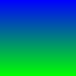

{}

## Photochop

This project puts together different concepts from throughout the course
and gives you experience going into a codebase and working with code
you did not write, which is what most software developers spend most
of their time doing. The codebase you are given is a simplified image
editor, which a collection of functions that allow reading, manipulating,
and displaying bitmap images. The existing functions are in a variety of
categories:

* Drawing a pattern
* Modifying an image
* Moving pixels
* Combining pixels
* Combining images

Your assignment will be to make two new functions, one each from two
different categories.  If you want to experiment further, you can make
more than two functions, as long as there are at least two that are in
different categories.

## Background

### Images

We can think of an image as a [grid of squares called pixels](http://computerscience.chemeketa.edu/cs160Reader/DataRepresentation/ImageRepresentation.html). Each pixel has a color value that can be represented as a [mix of red, green and blue](https://en.wikipedia.org/wiki/RGB_color_model).  If we allow each of these three color "channels" to have a value of 0–255, or 8 bits (1 byte) of storage, the color of one pixel is represented with 24 total bits (3 total bytes), allowing for over 16.7 million different colors.

If all three channels have the same value we get a shade of gray, ranging from 0,0,0 (black) to 255,255,255 (white). If some channels are different, we will get a color determined by the mix of the three. In general, higher numbers are brighter, and smaller numbers are darker.

### Codebase

First, download the [PhotoChop codebase](PhotoChop.zip) and unzip it. Included
are the code files, some sample images, and a Qt Creator project file so that
you can build and run the existing code. Start by getting that working and
looking around at what is there before you start making changes.

Treat the `ImageIOLib.h` and `ImageIOLib.cpp` files as black boxes—you
do not need to worry about them. If you're curious about how the program
is reading in image files, you can have a look inside, but it is not
part of the assignment.

The `Image.h` header declares important data types and constants.

```
typedef unsigned char byte;
```

An `unsigned char` is 1 byte, just the right size for storing a color
channel, so there is a typedef alias `byte` for us to use wherever in
the code we want such a value.

```
struct Pixel {
  byte red;
  byte green;
  byte blue;
};
```

A `Pixel` is a structure that holds three of those values together,
representing a complete color.

```
const int IMG_HEIGHT = 128;
const int IMG_WIDTH = 128;
```

To keep the codebase simple, it only works with images of a particular,
hardcoded size, in this case 128×128 pixels.

```
struct Image {
  Pixel data[IMG_HEIGHT][IMG_WIDTH];
};
```

An `Image` is a structure that uses a two-dimensional array of `Pixel`s
to represent a complete image.

The file `main.cpp` has code to create some images, as well as to load
an image and modify it. Use the existing code as a model for how to
write your own functions that do similar work. Note that you do not have
to understand the code behind `displayImage`. Just use it to show the
results of any work that you do by passing your image, a string and the
`mainLayout` to it.

## Function ideas

Make two or more functions that create or modify an existing image using the PhotoChop code. You must make your functions from different categories listed below (for example, you can't do two "Create New Image" functions). Here are some ideas, but feel free to invent your ideas or modify these suggestions.

### Drawing a pattern (e.g. `makeAqua` and `makeGradient`)

#### Box

Write a function that takes in parameters for starting row, column, width,
and height. It then uses those values to draw a white box (or whatever
color you like) on a black background.


#### Color gradient

Blend from one color to another.



#### Circle gradient

Calculate each pixel's RGB values based on the distance from the center of the image. Set each pixel to a gray value (same value for all three channels) based on pixel's distance from center. 


#### Snow

For each pixel in a new image, pick a random number from 0–255 and use that for all three color values.

### Modifying an image (e.g. `redShift`)

#### Only red 

Set the blue and green value for each picture to be 0. 


#### Grayscale red

Set the blue and green values for each pixel equal to their red value. (Or set red and blue equal to green, or set all three to the average of their values; each of those recipees produces a different grayscale image.)

#### Bluescreen

Identify any pixel where the blue value is higher than the red value. Turn those pixels to white (255,255,255). This filter should be able to clear most of the background in `crab.bmp`.

#### Crop center

Make a black or dark border around the edge of the image, only leaving the middle visible.


#### Invert

Set each color to be 255 minus the original value.


#### Darken or lighten

Multiply the red, green and blue values each by a value. A value between 0 and 1 will darken the image; a value > 1 will brighten the image.

#### Noise

For each color of each pixel, pick a random number from -20 to 20 and add it to the color value.

### Moving pixels (e.g. `rotateRight`)

#### Flip vertical or horizontal

Flip the image in one dimension or the other (left-right or up-down).

#### Rotate left

Make a rotation that goes the opposite direction from the provided `rotate`.

### Combining pixels (e.g. `blur`)

#### Sharpen

Multiply the current pixel's RGB values by 5 and neighboring values by -1. Add them all up–this is the new value.  Subtracting the neighboring pixels will enhance any color differences, making color transitions look more abrupt and thus "sharper"

Using 9 and -2 makes for a stronger effect. Just make sure the multipliers for the 5 cells add to 1.


#### Find edges

If you do a sharpen filter but make the current pixel multiplier value 4 instead of 5 (so that the multipliers add to 0 instead of 1), it will do a find edges type filter that shows solid areas of color as black and areas with sharp changes as bright.

#### 8-bit look

Copy pixels that are on an even row and column into their "odd numbered" neighbors (odd numbered rows and columns from original are not used).

### Combining images

You can open multiple files by making multiple `Image` structs and doing multiple
readImage calls.

#### Merge

Read in two separate images. Write a function that averages the values of corresponding pixels to create a new image. Or use the top half of one and the bottom of anther. Or alternate lines. Or blend so that you use 100% of one image at the top, 100% of the other at the bottom and gradually shift the weights…

#### Secret message

I hid a [secret message](http://en.wikipedia.org/wiki/Steganography) in crabMessage.bmp. Compare the pixels in it to the pixels in crab.bmp. If corresponding pixels have different green values, turn that pixel white. Otherwise, turn it black.

## Submit files

Add your new functions to `main.cpp`, and change the `main` function in that
file to show them off. When you are done, submit your `main.cpp` file in elearn.
If you have created or used any sample images other than the ones provided with
the codebase, you may submit them as well.

## Optional extra information about bitmap images

Data files are often stored in binary format. It is much more compact to
store the number 200000 as a 32-bit integer than as those six characters.
It is also faster to read in those raw bits instead of reading strings and
converting them to integers.

To read binary-formatted files humans usually use a hex editor, which shows each
byte of the file as a character:


File formats specify how a particular kind of file is to be written—how to interpret the 1\'s and 0\'s.
Below is a simplified description of the [file format for .bmp (bitmap) image files](http://en.wikipedia.org/wiki/BMP_file_format).

| Byte Address   | Description                                                       | Sample value from above screen shot |
| -------------- | ----------------------------------------------------------------- | -------------------------------------------------------------------------------------------------------------------------------------------- |
| 0              | Magic Number - verifies really is bmp data - always 66 (42 hex)   | 42 hex (66 in decimal) - represents character \'B\' |
| 1              | Magic Number - verifies really is bmp data - always 77 (4d hex)   | 4d hex (77 in decimal) - represents character \'M\' |
| 10             | Byte address image data starts                                    | Look in column 10 in the first row. The value is 36hex or 54 in decimal. The image data starts at byte \#54. |
| 18             | Width of bitmap                                                   | Find the 19th byte (address 18) - it is the third one in the second row. The value of 80 means the width is 80 in hex or 128 in decimal. |
| 22             | Height of bitmap                                                  | The height (also 80 hex/128 decimal) can be seen in byte \#22 (halfway across second row). |

{}
In the full file format, there are other pieces of information
that are stored at other addresses - this is just a sample of what is
there. Also, the width and height are stored as a 32-bit integers (not
just as one byte).
{}

The ImageIOLib functions do the work of parsing the file and reading the
image part of the data into an array.

It is possible to supply your own pictures as input to PhotoChop:
First, open the image you want to use in paint, gimp, photoshop, etc.
Save as bmp:


If you have options, use 24 bit color.


Make sure that the image you use is the same dimensions as specified by the constants in `Image.h`.
It is possible to change those constants to match, but some of the filters might not work correctly
(the supplied gradient function, for example, will wrap around, and the supplied rotate function only
makes sense for square images).

Have fun!
