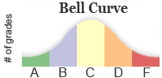

{}

## Objective

Upon completion of this assignment the student will be able to write
programs that use arrays.

## Background

Grading on a curve is the idea that we will statistically compare everyone to the average score,
those who are furthest from the average get A's or F's, those who are a bit closer to
the average get B's or D's and those closest to the average get C's. Something like
the picture below:



## Submission

* `gradeFunctions.h`
* `gradeFunctions.cpp`
* `assign7.cpp`

*I should be able to compile and run your program with:*

    g++ -std=c++11 gradeFunctions.cpp assign7.cpp -o program.exe
    program.exe       (./program.exe on a mac)

{}
Test building and running from the command prompt. It is possible to have something set up
in QTCreator that works there but does not work when I compile your code using the
commands shown above.
{}

## Assignment

Write a program to help assign grades to test scores based on a bell curve. It should read in
10 numbers (you can assume they are integers) representing 10 scores from a class.

From those scores you need to calculate and print the mean and then the standard deviation of
the scores to one decimal place.

{}
You can find a nice example of calculating the standard deviation of a list of numbers here: http://www.mathsisfun.com/data/standard-deviation-formulas.html (Note that we want population standard deviation, not sample. Population is what is shown first).
{}

Then for each score, your program should print out a letter grade based on the following criteria:

|     Student's Scores Is      |     Grade Is      |
|-  |-  |
|     More   than 1 times the standard deviation below the average      |     F      |
|     0.5-1   standard deviation below the average      |     D      |
|     Less   than 0.5 standard deviations below or above the average      |     C      |
|     0.5-1   standard deviations above the average      |     B      |
|     More   than 1 times the standard deviation above the average      |     A      |

### Sample run

{}
Enter 10 scores: `70  85  75  65  82  96  58  93  86  90` 
The average is: 80.0
The standard deviation is: 11.9
Student:  1  2  3  4  5  6  7  8  9  10
Grade:    D  C  C  F  C  A  F  A  B  B

{}

Why is student 1's grade a D? They scored 70, which is 10 less than the average. Divide
that by the standard deviation of 11.9 and you get ~.84, so they are between 0.5 and 1.0
standard deviations below the average.

Student 2 got a C because their 85 is 5 above the average. Divide 5 by 11.9 and you get ~.42.
They are less than 0.5 standard deviations above the average, so C.

### Functions

You should write and use the following functions to help do your work.
You can add others as you see fit. Declare your functions in `gradeFunctions.h`,
define them in `gradeFunctions.cpp`, and use them in your `main` function in
`assign7.cpp`.

#### void getArrayData(int scores[], int size)

Reads in values from the keyboard into the array

#### double average(const int scores[], int size)

Calculate the mean of an array

#### double standardDeviation(const int scores[], int size, double mean)

Calculate the standard deviation of an array given its values and its mean

#### char getLetterGrade(int score, double mean, double stdDev)

Calculate a letter grade for one score given a mean and standard deviation based on the
logic described above.

Examples:

Given a score of 70, mean of 80.0, and std deviation of 11.9: The score is 10 below the
mean. That is more than 0.5 times the standard deviation below the mean but less than 1.0
standard deviations below the mean. That means a grade of 'D'.

Given a score of 96, mean of 80.0, and std deviation of 11.9: The score is 16 above the
mean. That is more than 1.0 standard deviations above the mean. That means a grade of 'A'.

#### void calculateLetterGrades(const int scores[], char letterGrades[], int size)

Use the scores in **scores** to calculate letter grades for each student and place
them into **letterGrades** so that the grade for `scores[0]` is stored in
`letterGrades[0]`, the grade for `scores[1]` is stored into `letterGrades[1]`, etc...


{}
A solution without these functions will take a significant penalty even
if it produces the correct output.
{}

{}
Hint... while testing you might want to avoid typing in all that input over and over
and just hard code some example numbers into `main`:

```
int scores[] = {70,  85,  75,  65,  82,  96,  58,  93,  86,  90};
```

Once you are done with the other functions or about to turn in the
assignment, remove the hard coded array and call `getArrayData` instead.
{}
