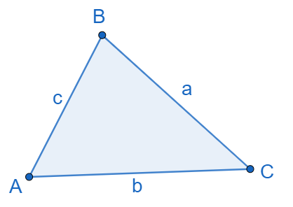

{}

## Objective

Upon completion of this assignment the student will be able to use
standard math functions.

## Assignment Instructions

*Submit file: assign3.cpp*

Recall from geometry that corners (vertices) and angles in triangles are
typically named with capital letters and the sides opposite them are
named with corresponding lower case letters:

Write a program that allows the user to enter the user to enter two sides
of a triangle, a and b and the measure of non-included angle A (in degrees)
and prints out the measures of the other two angles (if possible).

Note that there are three possible cases - no solution, one solution, or
two solutions (in which case you should print both possible pairs of angles).
Look for the section called Case 2: SSA or The Ambiguous Case on this web page
– it shows how to identify how many answers there are:

http://mathematics.laerd.com/maths/trigonometry-sine-and-cosine-rules-intro.php

To calculate the missing angles, you will want to use the Law of Sines:
$$ \frac{a}{sin A} = \frac{b}{sin B} = \frac{c}{sin C} $$

Given **a**, **b**, and **A**, to find B would want to focus on:
$$ \frac{a}{sin A} = \frac{b}{sin B} $$

And then rewrite it to solve for sinB:
$$ sinB = \frac{b \cdot sin A}{a} $$

Once you have sinB, you can use `asin` to figure out the measure of angleB (in radians!):
$$ angleB = asin(sinB) $$

You can find worked samples of the math (using degrees) on this web page. Examples 3, 4, and 5 on the website match
the sample runs below.  
http://mathematics.laerd.com/maths/trigonometry-sine-and-cosine-rules-3.php

{}
Hints:

* You will have to convert between degrees and radians and vice verse. Pay attention to when you are
using which unit. Good rules of thumb are: convert any degree input to radians immediately after
reading it in; Then convert any angles back to degrees right before trying to print them.

* Because doubles have inherit limits to their accuracy, you should not use `==` or `!=` to compare them.
Instead of "if x == y" you should write "if the difference between x and y is small enough". The standard
way to do that is something like: `abs(x - y) < 0.0001`. (Book section 3.6 part 6)

* Use *at least* 5 decimal places for PI: 3.14159. More places will give you more accuracy.

* Answers below are shown rounded – that is optional. If you want to round, \<cmath>
includes a round() function that can help you round to nearest whole number.

{}

-----------
### Sample run 1: (user input in red)

{}
Enter a: `28`
Enter b: `15`
Enter A: `110`  
Angle B = 30 degrees
Angle C = 40 degrees
{}

### Sample run 2: (user input in red)

{}
Enter a: `50`
Enter b: `100`
Enter A: `50`  
No solution
{}

### Sample run 3: (user input in red)

{}
Enter a: `15`
Enter b: `26`
Enter A: `29`  
Angle B = 57
Angle C = 94
OR
Angle B = 123
Angle C = 28
{}

### Sample run 4: (user input in red)

{}
Enter a: `5`
Enter b: `10`
Enter A: `30`  
Angle B = 90
Angle C = 60
{}
