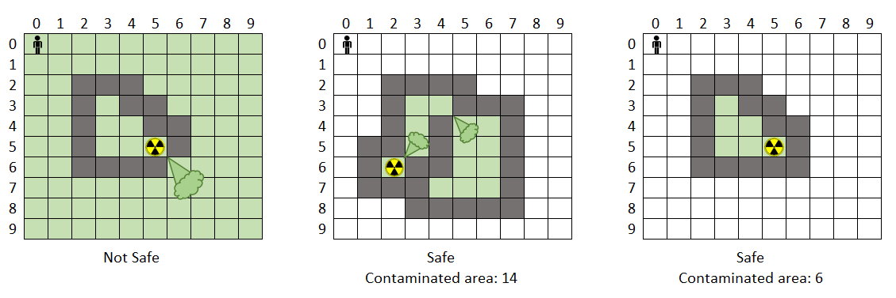

{}

## Assignment Instructions

*assign07.cpp*

This is an "old school" assignment where all your code will be in one file. I should be able to
do this to build your code:

```
g++ -g -std=c++11 assign07.cpp -o program.exe
```

## Problem Details

A containment wall has been built around a leaking radioactive storage tank. Unfortunately,
the wall may not have been built correctly. Anywhere two wall blocks meet at a corner, radioactive
gas can seep through and contaminate the area beyond. We need to know if the leak is contained
and if so, how badly contaminated the area is.

Your task is to read in the locations of the radioactive container and of all the walls
(each will be represented by an row / col pair) and decide if the leak is contained. The
end of the list of walls will always finish with 0 0 - do not place a wall there, that just
means end of input. Print out the final map whether it is safe or not. A leak that reaches 0 0
or any other border square is considered to be uncontained.

If the situation is safe, print out "Safe" and how many square units are contaminated. If
the radiation is not contained, print out "Not Safe".

You can assume that we will always be operating on a 10x10 grid like the ones shown below.



You may use a loop to get the inputs and for other jobs, **but the "contamination" and
count of the affected squares should be done recursively.**

No global variables allowed. You may not make a class that contains your functions.
Constants are OK.


## Sample Runs

{}
While testing your code, you should just copy and paste the long input sequence into
the terminal. (Right click in terminal window to paste).
{}

### Run 1

{}
Sample Input / Output: (User input in red)
Enter contaminated location (row col): `5 5`
Enter wall locations (row col), followed by 0 0 to indicate end of input:
`2 2  3 2  4 2  2 3  4 3  5 3  2 4  5 4  6 4  2 5  6 5  2 6  3 6  4 6  5 6  0 0`

&nbsp;  0 1 2 3 4 5 6 7 8 9
0  * * * * * * * * * *
1  * * * * * * * * * *
2  * * # # # # # * * *
3  * * # * * * # * * *
4  * * # # * * # * * *
5  * * * # # * # * * *
6  * * * * # # * * * *
7  * * * * * * * * * *
8  * * * * * * * * * *
9  * * * * * * * * * *

Not Safe
{}

### Run 2

{}
Sample Input / Output: (User input in red)
Enter contaminated location (row col): `2 6`
Enter wall locations (row col), followed by 0 0 to indicate end of input:
`1 5  1 6  1 7  2 2  2 3  2 4  2 5  2 7  3 2  3 6  3 7  4 2  4 3  4 4  4 5  4 6  0 0`

&nbsp;  0 1 2 3 4 5 6 7 8 9
0
1            # # #
2      # # # # * #
3      # * * * # #
4      # # # # #
5
6
7
8
9

Safe!
Contaminated area: 4
{}

### Run 3

{}
Sample Input / Output: (User input in red)
Enter contaminated location (row col): `1 6`
Enter wall locations (row col), followed by 0 0 to indicate end of input:
`0 5  0 7  1 5  1 7  2 5  2 6  2 7  0 0`

&nbsp;  0 1 2 3 4 5 6 7 8 9
0            # * #
1            # * #
2            # # #
3
4
5
6
7
8
9

Not Safe
*We reached the edge. That is not safe even if the rest of the map looks clean.*
{}