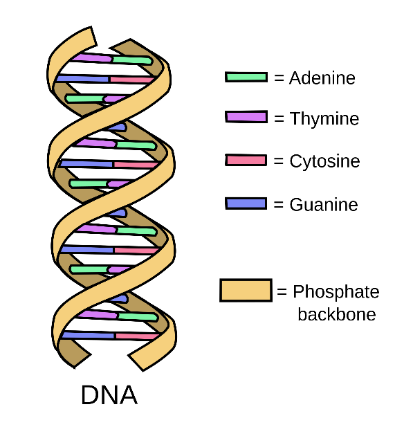

{}

## Background



DNA, or deoxyribonucleic acid, is the primary carrier of genetic
information in most organisms. The information in DNA is represented
using a string of nucleotides. There are four kinds of nucleotides:
Adenine, Thymine, Cytosine, and Guanine. They are typically abbreviated
to their initials, so a strand of DNA might be expressed as “ACTTGAT”.

These strands join together with a complementary strand to form
DNA's famous double helix shape. Adenine and Thymine always pair
up and Cytosine and Guanine always pair up. Thus, the strand:  
ACTTGAT  
Would always have a complementary strand:  
TGAACTA  
Where A in the original lines up with T in the new strand, C in the
original matches G in the new strand, etc…

## Assignment Instructions

*Submit files: DNAStrand.cpp, DNAStrandTester.cpp*

I should be able to add my own copies of DNAStrand.h and doctest.h and
build your project in the Chemeketa Development Environment with the
following command:

```
g++ -g -std=c++11 DNAStrand.cpp DNAStrandTester.cpp -o program.exe
```

Your task is to make a class that represent a DNA strand. A DNAStrand
will track its length and a character array to store the bases (which
will be stored using the characters A, C, G, and T). We will normally
create a DNAStrand by doing something like:

```
DNAStrand strand1("ACTGAGATA");
```

DNAStrand will also provide various operators and functions for doing
things like combining two strands, getting the complement of a strand or
searching for one strand inside another.

You are provided a [DNAStrand.h](DNAStrand.h) and
[DNAStrandTester.cpp](DNAStrandTester.cpp).  You should *not* modify
DNAStrand.h—you will not be turning it in; I will supply my own original
copy.  You should only modify DNAStrandTester.cpp to comment out entire
TEST\_CASEs that do not compile with your code or that cause a crash.
Do *not* modify a TEST\_CASE in any way except to comment the entire
thing out. Leave in any TEST\_CASES that compile and run, even if they fail.

Passing Test \> Failing Test \> Commented-Out Test \> Does not Compile

See below for tips on specific functions.

### Getting Started

You should make a Unit Test project and add the two given files to it.
(You do not need a “normal” project; you can do everything in the
unit test project.) You will need to make your own DNAStrand.cpp file.

Comment out all the tests but the first one in DNAStrandTester.
Implement the constructor and getLength and work until you pass test 1.
Then, work on one new test at a time, implementing only the new
functions needed to pass that test.

### Memory Management

You should use the Chemeketa Development Environment to test your code
for leaks or other memory errors. If you place your project folder in
the Vagrant shared folder, you can open it in QTCreator to work on it
in your host system, and at the same time, access the code within the
virtual machine to use DrMemory on it.

Work on the code in QTCreator—you can build and run the project from
there (and it will be built to the debug/ folder). Then periodically,
switch to the virtual machine and build your program to a linux/ folder
and test that build inside the VM with DrMemory.

Build (from the directory with your code—first make a folder there
called **linux**):  

```
g++ -std=c++11 DNAStrand.cpp DNAStrandTester.cpp -o linux/program.exe
```

Test (from that same directory):

```
drmemory -- linux/program.exe
```

DrMemory should give your program a clean bill of health. Any errors
reported by DrMemory will result in a significant deduction, even if the
program appears to work fine despite of them.

In particular, watch out for memory leaks. Memory leaks will not cause
any visible errors in your program—the only way to know that you have
a leak is to use DrMemory (or run your code long enough that you can
measure a steady increase in used memory).

Remember, DrMemory shows you where it detected an issue. Often, the place
where you caused the issue is somewhere else!  For example, maybe your
constructor did not allocate an array but that was not a problem until
later when you went to write to that array.

### Function Tips

{}
Design Note: Most of the functions we will write are non-modifying.
Once we make a DNAStrand, there is no way to change it other than the
assignment operator. If we want to do something like add two strands,
the originals will remain unmodified and we will end up with a new
strand that represents them stuck together. Objects that can't be
changed are known as **immutable**. Immutable objects are safer to pass
around with pointers or references (since they are essentially always
const). They also make it easier to write parallel code (no worries that
one thread will be working with an object while another modifies it).
The downside of immutable objects is we end up making lots of copies
since every “change” really just makes a new object. If we wanted the
class to be completely immutable, we would not provide an assignment
operator.

However, remember to allocate the “new” objects on the stack as local
variables and return them. Do not use the `new` keyword to allocate the
DNAStrand object you want to return, or the object would be allocated
on the heap and you would have to pass it as a pointer and remember to
explicitly `delete` it.
{}

{}
General restriction: you may *not* use `std::string` in this project.

The point of this assignment is to learn about what is involved in
making a string-like object and doing your own memory management.
{}

- `DNAStrand(const char* startingString)`

  Our basic constructor—it takes a char array (C-String) and sets the
  length and creates an array that holds the bases listed in the C-String.

  You can use `strlen` from `<cstring>` to figure out the length of the
  parameter, or write a loop that looks for the `\0` char. (See week 8 of
  161 for cstring material).

  Your DNAStrand's char array does not have to end in a null character.
  That means you should NOT try to use cstring functions on the array you
  are storing—they expect `char *`s to be marked with a null char where
  the valid data ends.

- `int getLength() const`

  Just return length.

- `bool operator==(const DNAStrand& other) const`

  Checks to see if the strands contain an identical list of bases. (i.e.
  “ATTAG” and “ATTAG”). Needed by the first test (and most others).  
  
  You can't just compare the arrays themselves with `==`; that will
  just see if the two DNAStrands are pointing to the same memory. You have
  to compare the individual items in the arrays. What is an easy way to
  tell that two strands can't possibly be identical?

- `~DNAStrand()`

  Destructor. Not tested directly—but every test will leak memory
  without this. Verify it works by running your program with drmemory.

- `DNAStrand(const DNAStrand& other)` and `DNAStrand& operator=(const DNAStrand& other)`

  Copy constructor and assignment operator. Tested in two unit tests.
  These are another big area for memory issues—test with DrMemory!

- `char operator[](int index) const`

  Gets a particular base. Return type is char instead of char& so that we
  can only read the bases and can't modify them. (Using something like
  `strand[2] = 'T'` won't work unless `operator[]` returns a reference.)

  This needs to throw an `out_of_range` exception if given a bad index.

- `DNAStrand(int length)`

  This private constructor builds a DNAStrand with the given length and
  should allocate an array big enough to hold that many chars (and not
  initialize them or init to all 0). Having this constructor will make
  other functions easier to write as they will be able to do something
  like:  
  
  ```
  DNAStrand temp(20); // I know it should be 20 long  
  //use loop to set temp's bases  
  return temp;
  ```

  It is private as we don't want other code using this special helper
  constructor. There are no tests for this (since it is private). But you
  will probably want to use it as part of any function that returns a
  DNAStrand.

- `operator+` and `getComplement`

  Check the .h for documentation. Note that all of these return a new
  object that has the desired DNAStrand. Don't try to modify the current
  strand. Each has their own test. You will probably need/want the
  DNAString(int length) constructor as a helper for these.

- `operator <<`

  Allows for easy output. Note that you can't rely on sending the whole
  array at once to the stream. That may work if there happens to be a 0 in
  memory after your array but will fail if there does not. (If you send a
  `char[]` to a stream, it assumes it must be a null-terminated C-style
  string. Yours is not.) Send the chars one by one to the stream.

- `DNAStrand substr(int start, int length) const`

  Get a new DNAStrand that contains the indicated portion of this
  DNAStrand. You will probably need/want the DNAString(int length)
  constructor as a helper for this. This should throw an `out_of_range`
  exception if the index or length are negative, or if the start + length
  would go past the end of the strand.

{}
As a student of computing science, you should notice that we are being
a bit wasteful with storage in this design.  With four possibilities for
each nucleotide, 2 bits are sufficient to distinguish which one we mean,
while the `char` type is 1 byte, or 8 bits. If storage were a concern,
we could fit 4 nucleotides per byte, at the expense of the code to read
and write them being more complicated.
{}
