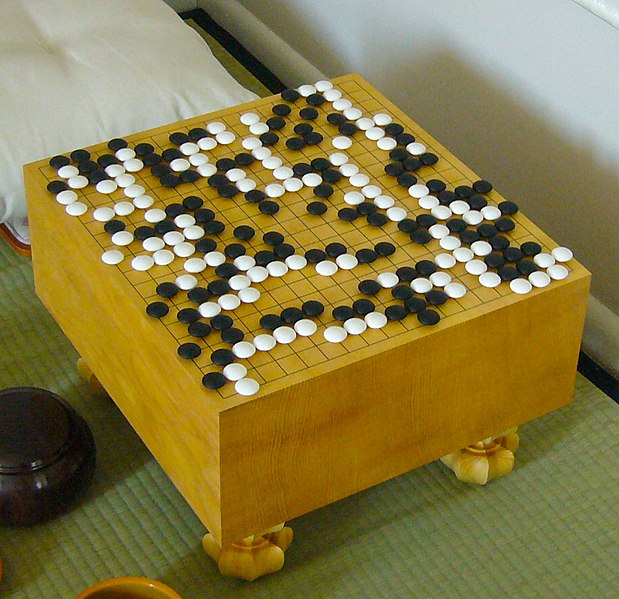
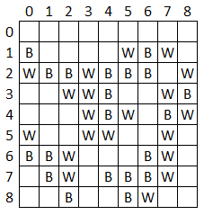
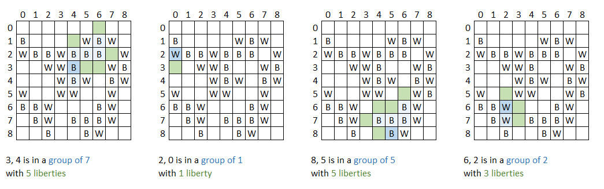

{}

## Assignment Instructions 

*Submit files: assign07.cpp*

I should be able to do this to build your code:

```
g++ -g -std=c++11 assign07.cpp -o program.exe
```

## Background



Go is a popular game in which players place black and white tiles and
attempt to capture as much of a square board as possible. The size of
the board can vary from 9x9 to 19x19 – these measurements refer to the
number of intersections in the grid lines – stones are placed on those
intersections.

Central to Go are the ideas of “groups” and “liberties”. A **group** is
a set of tiles, all of the same color, that are connected either
horizontally or vertically. A group’s **liberties** are the number of
moves that can extend the group to a new open location. If a group has 0
liberties, it is captured and removed from the board.

## Group/Liberty Counter

We will represent the 81 intersections in a 9x9 Go board with a 9x9
array and represent black and white pieces with the chars B and W.



Write a program that will read in a 9x9 go board from a file and then a
row and column from the console, and then print out: 1) how large the
group that location is a part of is 2) how many liberties that group
has. If the row, col the user enters does not have a W or B in it, print
an error message.

Below are shown some samples of the number of liberties that exist for
the groups that various tiles are a part of. The selected tile is shown
in dark blue, its group in light blue, and the liberties are shown in
dark green.  
  


(There is an error in the above diagram. In the first example, the group is of size 6 (not 7), with 5 liberties.)

{}
Your program must make use of a recursive function for determining the
size of the group and number of liberties. Do not use global variables;
you must use parameters to pass information from one recursive call to
another.

You may use loops to read in the data from the file.
{}

Your program should load the state of the board from a file called
“go.txt”. You may use this [sample file](go.txt).  I might use a
different board for testing your program.

{}
Do not hardcode path information into the file name. Just open “go.txt”
and make sure that the file is in your program's working directory.
{}

Printing just the group size is worth up to 80% credit. Worry about that
problem first. The liberty count is worth the last 20% of the assignment
and should involve mostly the same logic as your group count. It is fine
to use separate functions for the two jobs.

Here are some sample runs using the board shown above. (Each run of the
program should only ask for one location).

### Sample run 1

{}
Enter row & col: `3 4`
group size 6
5 liberties
{}

### Sample run 2

{}
Enter row & col: `2 0`
group size 1
1 liberties
{}

### Sample run 3

{}
Enter row & col: `0 4`
No tile at 0 4
{}
