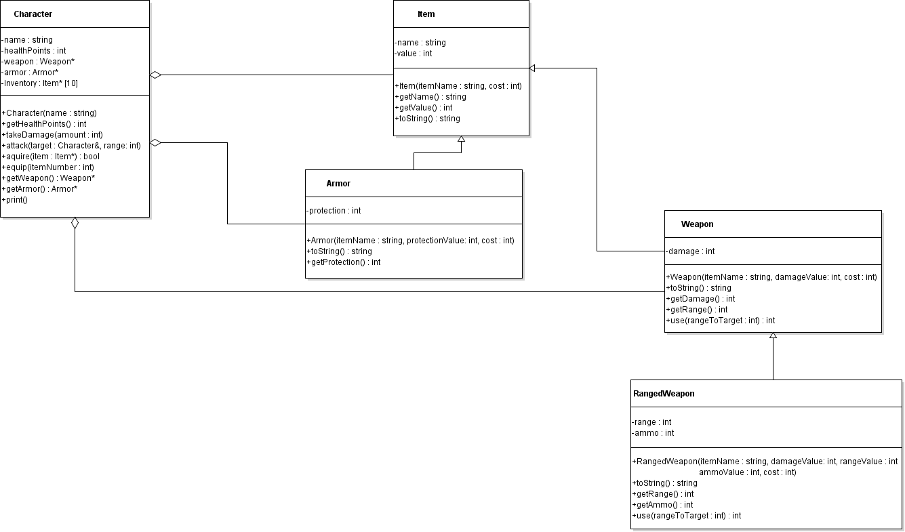

{}

## Requirements

*Submit files: Inheritance.zip*

Before submitting, delete any Makefiles in your directory, as well as
any subfolders (like “debug” or “release”).  Then zip up your
final version of the Inheritance folder.  Use zip, not 7z, rar, etc.

For example, on windows, you can right click the Inheritance folder, then chose Send
To → Compressed (zipped) folder.

  

After zipping, verify that inside the .zip is your Inheritance directory,
which contains your files. Submit your Inheritance.zip file to elearn.

## Background

This assignment is based on implementing some classes that might be used
in a computer game where characters move around, collecting equipment
and attacking each other.

## Assignment Instructions

Start with the code in [Inheritance.zip](Inheritance.zip).  It contains
a unit test project with files representing the classes shown in the
UML below. The class Character has been partially implemented; the other
classes have not been implemented. Your goal is to implement the classes
to match the UML and to pass all the unit tests provided.

The file `itemHeirarchyTester.cpp` has unit tests for the code you
will be writing in the first part. The unit tests start commented out;
uncomment them as you implement functionality. One you reach part 2, you
will add another file of unit tests. Use them the same way.

{}
Make sure the version you submit compiles.
If you do not get the
code working to compile against a test, leave it commented out. If tests
are commented out, I will presume that they will not even compile. I
will not turn them back on to test them.
{}

Make sure to leave on any tests that compile. As long as your code
compiles and runs, it is better to leave in a test that fails than
comment it out.

A test that runs and passes is better than a test that runs and fails,
which is better than a test that is commented out, which is better than
a test that does not compile.

Do not change the unit tests other than commenting/uncommenting entire
tests.

### Part 1: (85% of score)


Build the hierarchy of classes shown above so that they pass the unit
tests provided.

Do not modify the design shown above. In this case, if you feel like
you need another function, or that something needs to be made public,
reconsider how to use the tools you have.

The UML diagram does not indicate which functions need to be virtual. You
must decide which functions need to be virtual to behave correctly.

Use inheritance to minimize code duplication. Make sure you call parent
versions of functions instead of redoing the work.

Below you can find specific notes about the classes. They are listed in
the order you probably want to tackle them. Any `getXXX` functions not
mentioned below simply return the value of a member variable.

#### Item

Represents anything a Character can carry.

- `toString` should return a string formatted to look like:  

  > Lump of coal (value: 1)
    
#### Armor

Represents a piece of armor a character can wear. The `protection`
will be used to reduce the damage the character takes when attacked.

- `toString` should return a string formatted to look like:  

  > Leather pants (value: 10) Protection: 2
    
#### Weapon
    
Represents a weapon, which is presumed to be a mêlée weapon used for attacking at close range.

- `getRange` should return 0 (no range)

- `toString` should return a string formatted to look like:  

  > Sword (value: 10) Damage: 5

- `use` should return the damage an attack will do. Any attack on a
  target that is out of range of the weapon should do 0 damage. Attacks
  on targets in range of the weapon should do `damage` amount.

#### RangedWeapon

Represents a specialized kind weapon that can attack at longer range,
but has a limited amount of ammunition.

- `toString` should return a string formatted to look like:  

  > Bow (value: 30) Damage: 3 Ammo: 20 Range: 10

- `use` should check to see if there is ammo available (more than
  0). If so, remove one ammo and then behave like a weapon (check if
  target is in range to decide how much damage is done). If there is no
  ammo left, 0 damage is done.

### Part 2: (15% of score) 

In Part 2, you will add in a Character class that uses the various types
of Items and implement a function in that class. Use QTCreator to add the
existing files Character.h, Character.cpp and characterTester.cpp. They
are provided in the folder, but not included in the project so that you
can focus on building Item and its children.

Character makes use of Items, Armor and Weapons:



#### Character

Characters can `acquire` items (which may be an object of any of
the classes in the Item hierarchy).  Acquired items are added to the
first available index in the `inventory` array in the order they are
acquired. (We do not model getting rid of items).

{}
A character's inventory is made of `Item *`s, rather than `Item`s, so that
it can keep track of different kinds of items. An array of `Item` values
would lose the ability to treat the more specialized classes specially.
{}

A Character named Link who had acquired a Mace, Bow and Mail vest and
then equipped the Bow might look like this:

```
Link
Health: 100
Armor: Skin (value: 0) Protection: 0
Weapon: Bow (value: 30) Damage: 3 Ammo: 20 Range: 10
Inventory:
-----------------------------------
[0] Mace (value: 20) Damage: 4
[1] Bow (value: 30) Damage: 3 Ammo: 20 Range: 10
[2] Mail vest (value: 40) Protection: 4
-----------------------------------
```

The one function you need to implement is `equip`:

- `equip` should access the item at the given `index` from the
  inventory array. If it is a null pointer or invalid index, nothing should
  happen. If the item pointed to by that inventory item is a Weapon,
  the Character’s weapon should be set to it. It the item pointer
  points to an Armor, the Character’s armor should be set to it. The
  item remains in `inventory` even after it is equipped.  

For example, on the Character shown above, `equip(2)` would equip the
Mail vest as the character’s armor; `equip(0)` would equip the Mace
as the Character’s weapon, replacing the Bow.

{}
You can use `dynamic_cast` to see if a pointer can be made into a more
specific type.
{}

Just as you used `itemHierarchyTester.cpp` to test Part 1, enable the
the unit tests in `characterTester.cpp`, one-by-one as you work, in
order to test Part 2.
