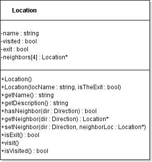
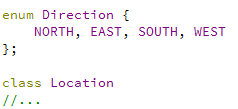
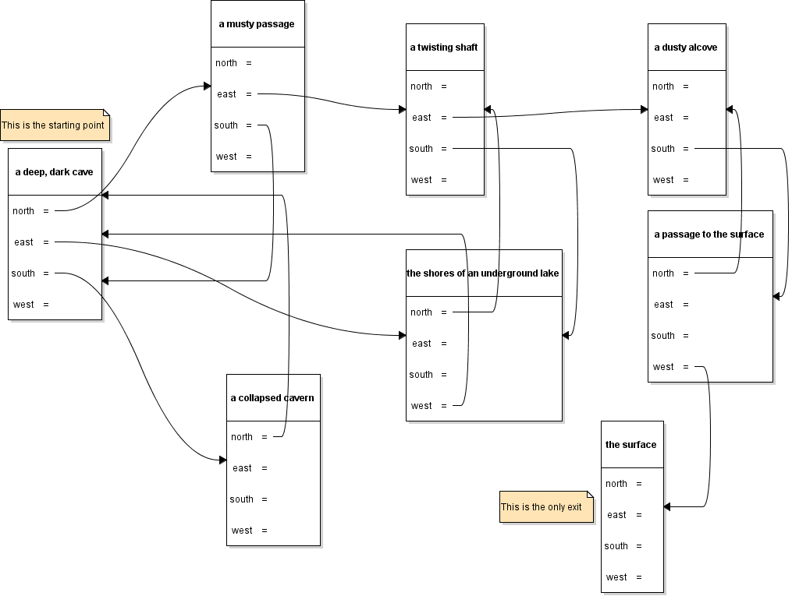

{}

## Objective

Your goal is to create a simple text based adventure game based on a
Location class.

## Requirements

*Submit files: Location.h, Location.cpp, main.cpp*

I should be able to build your code with:
`g++ -std=c++11 Location.cpp main.cpp -o program.exe`

## Location Class (80%)

The location class represents a location in the game. Each location can
be connected to up to 4 other locations (the locations that are North,
South, East and West of the current location). As the player explores
locations, they drop bread crumbs to mark where they have been before,
so each room keeps track of whether it has been visited yet.

Direction should be defined as an enumeration inside your .h file before
the class, like this:

You do NOT need full doxygen comments or unit tests (but feel welcome
to add them).

If you wish, you can store four separate pointers for the four possible
directions of travel instead of an array of pointers.

### Method behavior

- No arg constructor should just set the name to "?" all neighbors to
  null and everything else to false.

- The two arg constructor should set the name and exit members, setting
  the rest to null or false as appropriate.

- **hasNeighbor** returns true if there is another location in the
  specified direction, false if there is not (nullptr).

- **getNeighbor** returns a pointer to the neighbor in the indicated
  direction (or nullptr if there is not a neighbor).

- **setNeighbor** stores the indicated Location pointer as the
  designated neighbor.

- **visit** marks a room as having been visited.

- **isVisited** returns true if a room has been visited.

- **isExit** returns true if this Location is an exit.

- **getName** returns the name of the location.

- **getDescription** should return a string containing the name of the
  location, a list of the directions you can leave in and if it has
  been visited before. The first time we get the description for a
  room, it might say:  

  “a deep dark cave. Exits: north east south.”

  Or, for a different room that had been visited, something like:  

  “a musty passage. You have been here before. Exits: north east
  south.”

### Unit tests

You are provided with this [file of unit tests](LocationTester.cpp).

You can set up a tester project and use it to confirm that your
functions are working as expected before working on the real main
function. Note that the unit tests do not test getDescription.

## Main (20%)

Your `main.cpp` file should have the code for the game. It will build
a maze like the picture below and then run the game of trying to find
the exit.

{}
The map you create should exactly match this one.
{}

Players will type N, S, E or W to move to a new Location from the
currentLocation. If they type an unavailable option, say W while in "a
deep, dark cave", they should just stay where they are. When they reach
the endLocation ("the surface"), they game should end.

{}
Hint: An input of “S N E N E S W”, or any other valid sequence of
moves to reach the surface, should speed run through the maze and end
the program.
{}

You can add any helper functions that make sense to you. If you want,
you can use this [starter code for `main.cpp`](main.cpp).

It is a good idea to start filling in the function to build the map,
and to use the debugger to check that it creates the correct map before
trying to implement the game loop.
