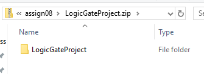
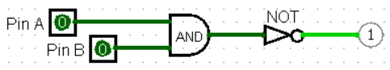
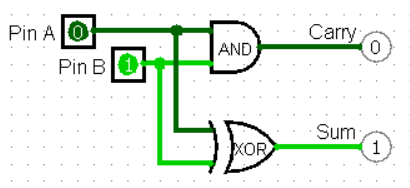
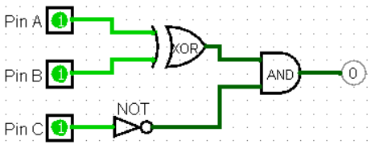
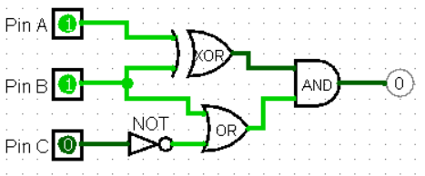

{}

## Requirements

*Submit files: LogicGateProject.zip*

Before submitting, delete any Makefiles in your directory, as well as
any subfolders (like “debug” or “release”).  Then zip up your
final version of the Inheritance folder.  Use zip, not 7z, rar, etc.

For example, on windows, you can right click the LogicGateProject folder,  
    
then chose Send To → Compressed (zipped) folder.  


After zipping, verify that inside the .zip is your LogicGateProject
directory, which contains your files. (There should not be another
LogicGateProject directory inside it.)



Submit your LogicGateProject.zip file to elearn.

## Background

This assignment is based on implementing logic gates. If you are not
familiar with this concept, start by reviewing the [CS160 Reader].

  [CS160 Reader]: http://computerscience.chemeketa.edu/cs160Reader/LogicCircuits/index.html

You will be implementing classes that can be used to create simulations
like these.

 

Start with the code in [LogicGateProject.zip](LogicGateProject.zip).
It contains a unit test project with stub files and one sample test for
the Pin class.

To implement useful circuits, you will need these components:

- Pins, the boxes in the screenshots labeled A and B that can be set
  to 0 or 1 (false or true)
- NOT gates, which take one input and negate it
- Two-input gates, such as AND, OR, and XOR, which take two inputs to produce a
  result.

Components will be “wired” together with pointers. Each component will
have pointers to the sources of its inputs; to find the overall result
of the circuit, one pulls at the output end, and each component reaches
back and pulls values from its inputs, which will pull values from any
inputs they need, and so forth back to the pins.  Components don't know
where their output is going, they just know where to get their input from.

If you want to implement the connections as type `shared_ptr<Component>`
instead of plain `Component *`, you may do so. It will not make the
project any easier or harder.

There is no need for dynamic memory allocation (no `new` or `delete`)
in this assignment; you can just declare components as local variables
and set them up with connections to each other. You should also have no
need to implement destructors for your classes.

Here is the UML for the expected final structure (see below for
implementation tips):


### `Component`

This will be an abstract class—it only serves as the common base class
for any component in the system. That way a `Component *` can point to
either a `Pin` or a `Gate`. All functions should be pure virtual.

- `getOutput`

  A subclass will implement this method to provide a way to ask for a
  component's output value.

- `linearPrint`

  A subclass will implement this method to print a one-line description
  of the logic connected to a component.

- `prettyPrint`

  A subclass will implement this method to print a multi-line, structured
  description of the logic connected to a component.

### `Pin`

Represents a controllable input to the circuit.

- `getOutput`

  Return the pin's `value`.

- `linearPrint`

  Print the pin's `label`.

- `prettyPrint`

  Print the padding, then the label, and then the value. For example, with a padding of “----”, print:

  ```
  ----A : 1
  ```

  With a padding of “”, just print:

  ```
  A : 1
  ```

### `NotGate`

Represents a NOT gate.

- `getOutput`

  Get the output value from the gate's `input` and return the opposite.

- `linearPrint`

  Print out a tilde, followed by the linearPrint of the gate's input in parentheses. This not gate:  

  

  Should print:  

  ```
  ~(C)
  ```

- `prettyPrint`

  Print out the padding, then “NOT”, then a pretty print of the
  gate's input padded in with two more "-" than we started with. For
  the previous example, with a padding of “”, print:

  ```
  NOT
  --C : 1  
  ```

### `TwoInputGate`

Represents any of these three basic two input gates: OR, AND, XOR. An
enum is provided to specify which. The gate's output
should be determined by combining the output of `input1` and `input2`
using the appropriate logical rule.

{}
For `bool` values such as we're using you can use `||`, `&&`, and `^`
to implement the three operations.
{}

- `linearPrint`

  Should print out the inputs, with the operator in between, surrounded
  by parentheses. Use the symbols `||`, `&&`, and `^` to be the operators.

    

  Should print:  

  ```
  (A && B)
  ```

- `prettyPrint`

  Print out the padding, then a string for the type of gate (AND, OR,
  XOR) and then pretty prints of its inputs indented with two more
  hyphens.

  ```
  AND
  --A : 0  
  --B : 0  
  ```

## Assignment Instructions

Here is what you actually need to do and point breakdowns. Note that 1-3
need to be done before 4, 5, and 6 but 4, 5, 6 can be done in any order.

### Part 1: 10%

Implement the `Component` and `Pin` classes so the provided test
passes. Do not worry about implementing the printing functions yet (stub
them out or leave them undeclared in all classes including `Component`).
`Component` should be an abstract class with all pure virtual functions;
there will be no need for a Component.cpp file as there will be no code
for it.

### Part 2: 20%

Implement the `NotGate` class and everything in it, except still do not
worry about the printing functions.

Write a unit test in LogicGateTester.cpp for the basic functionality of
the NOT gate. Implement something like below in the test:


This would mean making a Pin C, then a NotGate n1, then setting n1's
input to C.

You should make sure that the NotGate works correctly when C
is set to 0 and when it is set to 1.

### Part 3: 30%

Implement the `TwoInputGate` class and everything in it, except for
the printing functions.

Write three separate unit tests in LogicGateTester.cpp for the basic
functionality of the three different types gate. For example, the AND
test might construct a circuit like this:


This would mean making two Pins A and B, then one TwoInputGate and
setting the two inputs to be A and B.

There are four possible input states (0 0, 0 1, 1 0, 1 1) for the two
Pins. Make sure you test them all.

Remember to make separate test cases for AND, OR, and XOR.

### Part 4: 20%

Implement a unit test for the circuit below. (Passing this should not
require new code—it should just stress test what you did earlier).



You probably want to work your way up to this circuit. First test just
a Pin, then a NotGate connected to a Pin, then an AND connected to
two pins…

Note that there are 8 possible states for the inputs, but when C is 1,
the output is always off. Test at least the following three cases:

| A | B | C | output |
| --- | --- | --- | --- |
| 0 | 1 | 0 | 1 |
| 0 | 0 | 0 | 0 |
| 0 | 1 | 1 | 0 |

### Part 5: 10%

Implement `linearPrint` in all classes.

Write a unit test that sets up this circuit and prints it.



The expected output would be:  

```
((A ^ B) && (B || ~(C)))
```

Don't worry about capturing the output for the unit test to know whether
it passed or failed; just look at the output.

### Part 6: 10%

Implement `prettyPrint` in all classes.

Write a unit test that sets up the circuit given in part 5 and prints
it. The expected
output would be:

```
AND
--XOR
----A : 1  
----B : 1
--OR
----B : 1  
----NOT  
------C : 0
```

Note that the first component is printed with no padding. If `prettyPrint`
is implemented correctly, each additional layer is printed with two more
hyphens of padding than the previous layer so that they are nested like
an outline.
