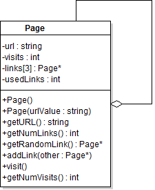

{}

## Objective

Learn how to use pointers to link objects.

## Requirements

*Submit files: Page.h, Page.cpp, main.cpp*

I should be able to build your code with:
`g++ -std=c++11 Page.cpp main.cpp -o program.exe`

## Background

The PageRank algorithm (http://en.wikipedia.org/wiki/PageRank) is the heart of the
original algorithm used by Google to rank search results. It works by simulating
an internet surfer randomly clicking links to navigate the internet.

Pages that have lots of links to them, or pages that have links from other popular pages,
will get more visits by this random surfer. These pages are assumed to be more important
and are displayed higher in the search results.

Your goal is to create a model of the random surfer process used by the PageRank algorithm.
You will need to build a small group of interconnected webpages (represented by Page objects)
and then simulate random clicking on links.

## Page Class (80%)

The Page class represents a web page. Each page keeps track of its name (**url**), the number
of times it has been **visited** (starts at 0), how many pages it links to (**usedLinks**),
and a list of up to 3 other pages it links to (**links** array).

### Function Descriptions

Below are notes about expected behavior for functions.

You do NOT need full doxygen comments.

#### Page()

Should set url to "", both ints to 0 and all links to nullptr

#### Page(urlValue : string)

Should set url to indicated value, everything else as above

#### getNumLinks()

Should return the number of usedLinks

#### addLink(other : Page*)

Should store the given pointer into the links array at the next available location and
increment the number of usedLinks

#### getRandomLink()

Should select a random address from the links the page has and return it.
Note you should only return "valid" links. If usedLinks is currently 2, you should
only return either link 0 or 1.

Assume the random number generator is already seeded - you do NOT want to re-seed it
each time this is called.

If this function is called on a page with 0 links, you can either kill the program with
an assertion or return nullptr

#### visit()

Should add one to the number of visits this page has seen

#### getNumVisits()

Returns the number of visits for this page

### Unit tests

You are provided with this [file of unit tests](PageTester.cpp).

You can set up a tester project and use it to confirm that your
functions are working as expected before working on the real main
function.

## Main (20%)

Once you pass all the tests you should be ready to write a real main.
Your `main.cpp` file should have code to run the following simulation.

1. Build a group of four pages and connect them as shown below:

    

{}
The network you create should exactly match this one.
{}

2. Starting on page1, do the following 1,000,000 times:

    * Select a new current page by doing the following:
        * Pick a random number between 1-100.
        * If the current page has no links, or the number if 15 or less, change the current page to 
        one of the four pages selected at random (equal chance for each).
        * Otherwise ask the current page for a random link and make that the new current page.

    * Visit that page

3.  After doing the random surfing, for each page, print out its name and what percentage of the
1,000,000 total visits that were to this page.
