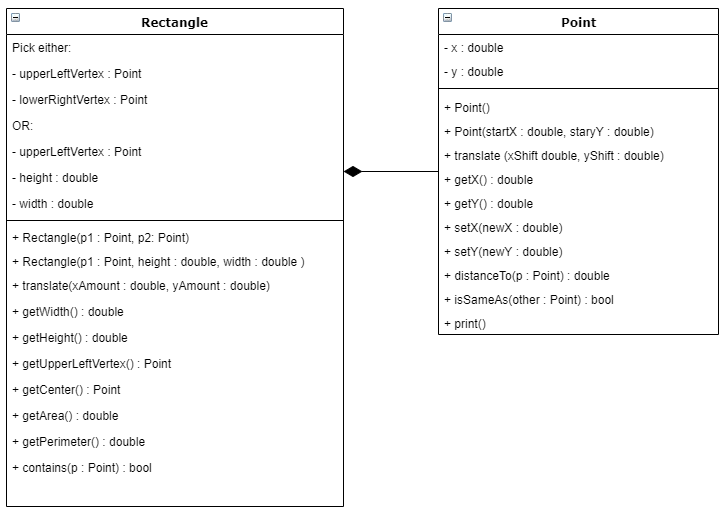
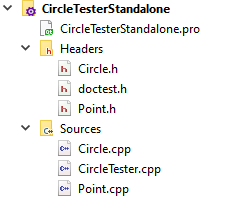
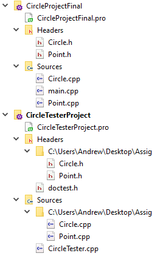

{}

## Requirements

*Submit files: Rectangle.h, Rectangle.cpp, RectangleTester.cpp*

Provide doxygen comments for all public members in your Rectangle.h file.

If I place all your code in one folder along with `doctest.h` and my
`Point.h` and `Point.cpp`, I should be able to do this to build your code:

`g++ -std=c++11 Point.cpp Rectangle.cpp RectangleTester.cpp -o program.exe`

## Overview

You will create a class Rectangle that represents a simple rectangle on a Cartesian
plane.  You are not writing any particular program that uses rectangles,
but the tool that could be used by someone who wanted to write a program
and use your Rectangle class to do it. The way you will demonstrate your
code works is by providing unit tests in `RectangleTester.cpp`.

Your Rectangle class will use a provided Point class.

* [`Point.h`](Point.h)
* [`Point.cpp`](Point.cpp)

See Project Setup Instructions section for more details.

## Rectangle Details

For the purposes of this problem, we will assume our rectangles are always aligned
with the axes (their sides are always perfect up and down or side to side). 
A rectangle that is aligned to the axes can be described by the location of its
upper left vertex, a width, and a height:



There are of course other ways we could represent the shape. We could also
describe it with the location of its upper left corner and lower right corner.
Or we could use its center and the height and width. Etc...

Your task is to implement one of these representations using the UML shown below:



Note the **OR** in the section that describes the member variables. You can chose
either of those representations, or make a different one. Any given representation
will make some jobs easier and some jobs harder. *(The upperLeftVertex, height, and width
representation is probably the easiest overall.)*

## Function Descriptions

Below are descriptions of expected behavior. Descriptions are written
in UML format, not C++. You need to translate parameters/return types.
UML also does not specify things like const qualifiers and passing by
reference; it is up to you to use them where it is appropriate.

For each function, provide one or more TEST\_CASES in the
`RectangleTester.cpp` file that show the function works. See Testing
Guidelines below.

Each function should have doxygen comments in your .h file.

When possible, use functions from Point to help you do work.

### Rectangle(p1 : Point, heightValue : double, widthValue : double)

Construct rectangle using given point as upper left corner and the indicated width and height

### Rectangle(p1 : Point, p2 : Point)

Construct rectangle that has the two points as opposite vertices. The two points might not be
in order as upperLeft and lowerRight. The constructor should figure out appropriate coordinates
to use for its state based on coordinates of these two points.

Example: If the Points given are (10, 5) and (4, 2), the rectangle should have an upper left
vertex of (4, 5), and either a height of 3 and  width of 6 or a lower right vertex of (10, 2)

### getUpperLeftVertex() : Point

Return Point representing location of the upper left vertex of the rectangle

### getWidth() : double

Returns value

### getHeight() : double

Returns value

### getArea() : double

Calculate and return value

#### getPerimeter() : double

Calculate and return value

### getCenter() : Point

Calculate location at center of rectangle, make a Point representing it to return.

### translate(x : double, y : double)

Translate is the fancy word for "move". Move the rectangle by the given amount in
x and y dimensions.

### contains(p : Point) : boolean

Return true if indicated Point is within the rectangle (on edge counts as within)

## Testing Guidelines

Your Unit tests in RectangleTester.cpp should test each public member.
Each TEST\_CASE should focus on testing one function. It is **NOT** okay
to wrap a bunch of unrelated tests into one test function (e.g. one
TEST\_CASE that tests both getPerimeter and getArea). It is okay, in fact
necessary, to use other functions as part of your tests—for example,
it would be impossible to test the constructors without using getPoint
function.

{}

If you are on Windows, you may have a conflict between your Rectangle class and one that
is part of a standard library. If you see weird errors talking about Rectangle, add this
line to the top (it must come before `#include "doctest.h"`) of your RectangleTester.cpp file:

    #define NOGDI

{}

You may need multiple tests for any given function (a bool function
should be tested to make sure it answers both true and false at
appropriate times).

My Assignment2CircleSample project in the class git repository has sample
unit tests. You won't be writing the same exact tests, but use them
as a reference.

Here is a sample test, for your Rectangle constructor and `getUpperLeftVertex`,
to get you going.  The `getUpperLeftVertex` method will be tested in lots of other
places; you do not need to write a separate test for it.

```
TEST_CASE( "Rectangle/Constructor1 - 3 Arguments" ) {
    //Build rectangle
    Point p1(1, 5);
    Rectangle r1(p1, 2, 4);
    //now see if it has the right info
    Point temp = r1.getUpperLeftVertex();
    REQUIRE( temp.isSameAs(p1) == true );


    //dimensions are doubles, compare using Approx from doctest to check equality
    REQUIRE( r1.getHeight() == Approx(2) );
    REQUIRE( r1.getWidth() == Approx(4) );
}
```

Note if you want, you could condense these two lines: 

    Point temp = r1.getUpperLeftVertex();
    REQUIRE( temp.isSameAs(p1) == true );

Into this one line that asks r1 for its upper left vertex, then ask that if it is the same as p1: 

    REQUIRE( r1.getUpperLeftVertex().isSameAs(p1) == true );


## Setup/Starting Tips:

### Option A - Just make a Unit Test Project (no "real" project).

1.  Make a Chemeketa Unit Test project.

2.  Copy [`Point.h`](Point.h) and [`Point.cpp`](Point.cpp) into that folder.

3.  Right click the project in QTCreator, "Add Existing" and choose the
    `Point.h` and `Point.cpp` that you copied into it.

4.  Make your `Rectangle.h` and `Rectangle.cpp`

5.  Rename the sample test file to RectangleTester. You should have something like
    this(but Rectangle instead of Circle):  

    

### Option B - Make a "real" project and a separate Unit Test Project

1. Make a normal Chemeketa project. Add a `Rectangle.h` and `Rectangle.cpp` to it.

1. Copy [`Point.h`](Point.h) and [`Point.cpp`](Point.cpp) into that folder.

1. Right click the project in QTCreator, "Add Existing" and choose the
    `Point.h` and `Point.cpp` that you copied into it.

1. Follow the instruction from the UnitTestDemo activity to set up a
    second unit testing project. You will need to use Add Existing to
    the tester project to link in these four files from your other
    project folder: `Point.h`, `Point.cpp`, `Rectangle.h`, and `Rectangle.cpp`.
    Make sure to add the `INCLUDEPATH += ???` line where ??? is a path to
    the real project.

1. Rename `sampleTester.cpp` `RectangleTester.cpp`.

1. Your two projects should look like this (but with Rectangle instead
    of Circle):  

    
