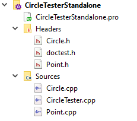

{}

## Requirements

*Submit files: Triangle.h, Triangle.cpp, TriangleTester.cpp*

Provide doxygen comments for all public members in your Triangle.h file.

If I place all your code in one folder along with `doctest.h` and my
`Point.h` and `Point.cpp`, I should be able to do this to build your code:

`g++ -std=c++11 Point.cpp Triangle.cpp TriangleTester.cpp -o program.exe`

## Overview

You will create a class Triangle that represents a triangle on a Cartesian
plane.  You are not writing any particular program that uses triangles,
but the tool that could be used by someone who wanted to write a program
and use your Triangle class to do it. The way you will demonstrate your
code works is by providing unit tests in `TriangleTester.cpp`.

Your Triangle class will use a provided Point class.

* [`Point.h`](Point.h)
* [`Point.cpp`](Point.cpp)

See Project Setup Instructions section for more details.

Here is a UML diagram of what you are building.


Below are descriptions of expected behavior. Descriptions are written
in UML format, not C++. You need to translate parameters/return types.
UML also does not specify things like const qualifiers and passing by
reference; it is up to you to use them where it is appropriate.

For each function, provide one or more TEST\_CASES in the
`TriangleTester.cpp` file that show the function works. See Testing
Guidelines below.

When possible, use functions from Point to help you do work.

  - **Triangle(p1 : Point, p2 : Point, p3 : Point)**  
    Construct triangle using the three Points as the verticies

  - **getPoint(number : int) : Point**  
    Takes value expected to be 0, 1, 2 and returns corresponding vertex
    from triangle. (You don't have to handle bad indexes. This would be
    a good spot for an exception—which we learn about later. For now,
    just assume the argument is valid.)

  - **setPoint(number : int, p : Point)**  
    Takes value expected to be 0, 1, 2 and a Point. Stores that point as
    the indicated vertex. (Again, you do not have to handle bad
    indexes.)

  - **getArea() : double**  
    Calculate and return value. (Google Heron's formula)

  - **getPerimeter() : double**  
    Calculate and return value.

  - **getAngle(number : int)**  
    Return the measure of the given angle in degrees. (Angle 1 would be
    one with p1 as its vertex, Angle 2 would be one with p2 as vertex, …).

    Math hint: You can find the [formula here] (look for "Easier Version For Angles").

      [formula here]: https://www.mathsisfun.com/algebra/trig-cosine-law.html

    Remember that the `acos` function will return angles in radians. To turn into degrees you must multiply by 180 and then divide by π.

  - **translate(xShift : double, yShift : double)**  
    Translate is the fancy word for "move". Move the triangle by the
    given amount in x and y dimensions. Do so by moving all three
    vertices.

  - **contains(p : Point) : boolean**  
    Return true if indicated Point is within the triangle.  
    Call three points of Triangle A, B, C. Two suggested strategies:
    
      - Calculate area of triangles PAB, PAC, PBC. If the sum of those
        are approximately equal to area of ABC, P must be inside.
    
      - Point P is inside a triangle if it is consistently to the right
        or left of segments AB, BC, and CA.  

        This [code sample] shows the math involved. You would need to
        adapt it to work as a member function. You can add a non-member
        sign function to your .cpp code as a helper to the member
        function.

          [code sample]: https://stackoverflow.com/questions/2049582/how-to-determine-if-a-point-is-in-a-2d-triangle?lq=1

## Testing Guidelines

Your Unit tests in TriangleTester.cpp should test each public member.
Each TEST\_CASE should focus on testing one function. It is not okay
to wrap a bunch of unrelated tests into one test function (e.g. one
TEST\_CASE that tests both getPerimeter and getArea). It is okay, in fact
necessary, to use other functions as part of your tests—for example,
it would be impossible to test the constructors without using getPoint
function.

You may need multiple tests for any given function (a bool function
should be tested to make sure it answers both true and false at
appropriate times).

My Assignment2CircleSample project in the class git repository has sample
unit tests. You won’t be writing the same exact tests, but use them
as a reference.

To figure out what your answers should be, you might want to use [this calculator].

  [this calculator]: https://www.triangle-calculator.com/?what=vc

Here is a sample test, for your Triangle constructor and `getPoint`,
to get you going.  The `getPoint` method will be tested in lots of other
places; you do not need to write a separate test for it.

```
//Helper function - feel free to use in your tests
Triangle makeT1() {
    Point p1(0, 0);
    Point p2(6, 0);
    Point p3(3, 5);
    return Triangle(p1, p2, p3);
}

TEST\_CASE( "Triangle/Constructor" ) {
    //Set up a triangle using helper - could just do work here
    Triangle t = makeT1();

    //Check the vertices

    //Vertex A - wordy version
    Point tempA = t.getPoint(0);
    Point tempAGoal(0, 0);
    REQUIRE( tempA.isSameAs(tempAGoal) );

    //Vertex B - check vs anonymous point
    Point tempB = t.getPoint(1);
    REQUIRE( tempB.isSameAs( Point(6, 0) ) );

    //Vertex C - super terse - harder to debug...
    REQUIRE( t.getPoint(2).isSameAs( Point(3, 5) ) );
}
```

## Setup/Starting Tips:

### Option A - Just make a Unit Test Project (no "real" project).

1.  Make a Chemeketa Unit Test project.

2.  Copy [`Point.h`](Point.h) and [`Point.cpp`](Point.cpp) into that folder.

3.  Right click the project in QTCreator, "Add Existing" and choose the
    `Point.h` and `Point.cpp` that you copied into it.

4.  Make your `Triangle.h` and `Triangle.cpp`

5.  Rename the sample test file to TriangleTester.

### Option B - Make a "real" project and a separate Unit Test Project

1.  Make a normal Chemeketa project. Add a `Triangle.h` and `Triangle.cpp` to it.

2.  Copy [`Point.h`](Point.h) and [`Point.cpp`](Point.cpp) into that folder.

3.  Right click the project in QTCreator, "Add Existing" and choose the
    `Point.h` and `Point.cpp` that you copied into it. You should have this (but Triangle instead of Rectangle):  

    

4.  Follow the instruction from the UnitTestDemo activity to set up a
    second unit testing project. You will need to use Add Existing to
    the tester project to link in these four files from your other
    project folder: `Point.h`, `Point.cpp`, `Triangle.h`, and `Triangle.cpp`.

5.  Rename `sampleTester.cpp` `TriangleTester.cpp`.

6.  Your two projects should look like this (but with Triangle instead
    of Rectangle):  

    
