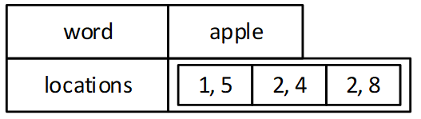
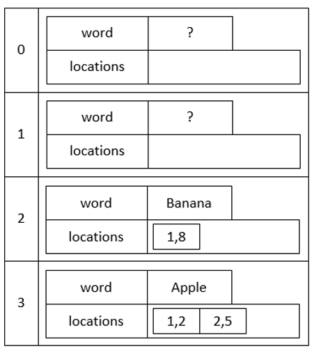

---
# Page metadata.
title: Assignment 5
summary: HashTable

layout: single
---

Upon completion of this assignment you will be able to use hash tables to create data structures
and understand the standard interface for a map/dictionary type.

## Setup

Begin by accepting the assignment repository listed in Elearn.

Then add these data files:

* [GreatExpectations.txt](files/GreatExpectations.txt)

It will not be checked into the repository.

## Submission

You should submit the following:

* In Elearn: A pdf document with your responses to write up questions.

* Push final changes to github before the assignment deadline.

## Overview

The following files are provided in the repository:

* **IndexRecord.h** and **IndexRecord.cpp** - which define some structs that will be used in the
program. You may add functions to the .h, but should not change the existing function signatures.
* **IndexMap.h** and **IndexMap.cpp** - in which you will implement a HashMap of IndexRecords.
You may add new functions to the .h, but should not change the existing function signatures.
* **tester.cpp** - has a main function that runs tests on IndexMap

You will add:

* **IndexBuilder.cpp** with your main function for building a book index for GreatExpecations.txt.
* A makefile entitled **MyMake**
    * The default rule should build the programs linux/Assign5Tester.exe and linux/Assign5Index.exe
    * linux/Assign5Tester.exe should be built using tester.cpp, IndexMap.cpp and IndexRecord.cpp.
    * linux/Assign5Index.exe should be built using IndexBuilder.cpp, IndexMap.cpp and IndexRecord.cpp.

## Assignment Requirements & Output

* You should write one main function that does each of the assignment parts in order.
You should use functions to make your main a manageable length and easy to understand.
* Implement functions as efficiently as reasonably possible.
(Reasonable means you pick the optimal BigO based on learned structures.)
* Do not prompt for ANY input other than what is specified for in the descriptions below.
* Your code should not have memory leaks or other memory related errors. Check with Dr. Memory.

### Output

Anything you are asked to print out should be printed in your final program with a clear label.

Label each section's output and print something like this before each section:
```
-----------------------------Section 1----------------------------
…
```

There should not be a lot of extra debugging output.

## Grading

Your code will be built and tested using the Linux based Chemeketa Development Environment. Your
code must compile and run in that environment to receive credit.

{}
I will score the output of your program as is. I will not fix parts of your code so that I can
test other parts. If your program dies trying to run part 2 of an assignment, you will NOT get
credit for the output of any parts after that, even if they would work perfectly.
{}

You can get partial credit for code that is mostly there but broken. The maximum amount of
credit awarded for each section will be:

* Code runs and provides correct output - full credit.
* Code runs and provides incorrect output - partial credit, potentially quite high.
* Code does not run or produce output (potentially because the program crashed in a previous
section)- partial credit - generally less than incorrect output.
* Code that is commented out - partial credit. Less than incorrect output. If part of a program
crashes but later parts work correctly, comment it out and leave a note in the output like
"Part 4 disabled… causes crash" so I know to go check out what you did.
* Code that never runs because something before it crashed. Same as commented out code.

## Part 0

(0% of grade - required for assignment to be graded)

Make a makefile called **MyMake** - when the make utility is executed with it, it should build
the programs **linux/Assign5Tester.exe **and **linux/Assign5Index.exe**

I will run your code by cd'ing into your directory, doing `make -f MyMake` and then running
`linux/Assign5Tester.exe` followed by `linux/Assign5Index.exe`

## Part 1

(10% of grade)

Examine the existing code in IndexRecord.h and IndexRecord.cpp.

They define a struct **IndexLocation** that represents a page number and word number on the page.
We would construct something like IndexLocation(1, 5) to indicate the 5th word on page 1.
Nothing needs to be done for this struct, you will simply be making use of it.

They also define an **IndexRecord** struct. An IndexRecord consists of a word and a vector
locations containing IndexLocations. A structure like this might correspond to a record for
the word "apple" that appears on page 1, word 5 and on page 2 as words 4 & 8.



Write the **addLocation** and **hasLocation** functions:

**void IndexRecord::addLocation(const IndexLocation& loc)**  
*Adds loc to the locations for this record*

**bool IndexRecord::hasLocation(const IndexLocation& loc) const**  
*Checks to see if the record contains the given location. You can use any of the
std::algorithms as helpers in this function or hand code it.*

The code in the first part of tester.cpp will demonstrate the functionality.

## Part 2

(40% of grade)

Examine the existing code in **IndexMap.h** and **IndexMap.cpp**.

In it, you will implement a hash map of IndexRecords.

IndexRecords should be placed into the map using the **word** in the record as the *key*. The *value*
associated with each key will be an **IndexRecord**. Collisions should be resolved by linear probing.



Implement the functions needed for the second half of tester.cpp.

## Part 3

(30% of grade: 20% code, 10% writeup)

The file GreatExpectations.txt has the text of the book Great Expectations broken into "pages"
by the string "----------------------------------------". All other punctuation has been removed.

In **IndexBuilder.cpp**, use your IndexMap to read in the file and build an index of the contents
of the book. Page numbering should start at 1, as should word numbering on each page.
Examples: *Great* is word 1 of page 1; *Chapter* is word 1 of page 2; *the* is word 4 of page 3.

All "words" - including things like chapter numbers (I, II) - should be indexed. As you build
the index, you should remove all capitalization (your map should consider "apple", "Apple", and "aPPlE"
to be identical - they all are "apple").

**Print out the time to build the index.**

**Print out the number of keys stored in the index (the number of distinct words in the book).**

**Get and print out the IndexRecord for the word "fathers"**

### Writeup

3A) Give an estimation of how long building the index would take using a **self-balancing binary
tree** of IndexRecords instead of a hash table. Show calculations used to produce the estimation.
In your work, call the number of distinct words **n** and the number of total words **m**. (There are
approximately 186,000 words in the file.)

3B) Give an estimation of how long building the index would take using an **array/vector** of
IndexRecords instead of a hash table. Show calculations used to produce the estimation. In
your work, call the number of distinct words **n** and the number of total words **m**.

## Part 4

(10% of grade)

Implement the findWordPairs function. A call like:  
`map.findWordPairs("great", "expectations");`  
Should print out all locations where the first word is directly followed by the second word. i.e.
all the places in the file where "great expectations" appears. If you prefer, you can modify
the function to return a new IndexRecord for the combined phrase or a vector of IndexLocations.

**In IndexBuilder.cpp call the function to print out the locations for "great expectations".**

## Part 5

(10% of grade)

Implement the function firstWordOnPage. This function does a reverse lookup in the hash-table:
given a location (word 3 on page 4) it finds the associated key.

**In IndexBuilder.cpp call the function to get the first word on page 100 and print the result.**
