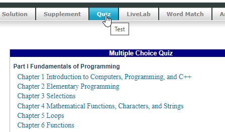

## Learning Objectives

Upon finishing this learning module, you should be able to:

* Use standard library functions to do math and work with characters
* Generate pseudorandom numbers for a desired range
* Use the char data type and understand how it relates to int

## Schedule

### Day 1

* Monday is a Holiday - no class meetings

### Day 2

* Random numbers and math functions
* Read Ch 3.9, 3.12, 4.1-4.2
* CPPLab Math Functions

### Day 3

* Chars
* Read Ch 4.3-4.7
* CPPLab Characters

### Day 4

* Review & Take Quiz

## Online Activity Outline

### Using Functions

Read 3.9 on random numbers. This video explains some of the basics:  



Read Ch 4.1 and 4.2. These videos explain some of the basics:  




Do Numeric Functions CPPLab.

### Chars

Read Ch 4.3-4.7. This video explains a bit about chars  



Do Characters CPPLab.

## Quiz

The quiz will be open Thursday–Saturday in Elearn, **time limited**
(60 minutes), and **not** collaborative. It covers weeks 1 & 2. Make sure
you block out an hour of uninterrupted time before you start the quiz — you
can not pause the timer once you start.

To practice, go to the [Resource Links]( "Resource Links")
and look for "Book author's website". On the author's website, look for the Quiz tab:

The practice questions are based on the third edition of the book, so later chapters
may be numbered slightly differently, but the questions are still great practice.

For quiz 1, focus on Ch1, 2, and 3 (especially 2 and 3) to get ready for the quiz. The
quiz will be some multiple choice, some short answer, and some writing code. Make sure
to read the directions carefully before beginning. 

## Extra Info

### Learncpp.com

This online tutorial covers *some* of the same ground as the Liang
readings:  
[LearnCpp.com 2.7, 5.9](http://www.learncpp.com/)  
