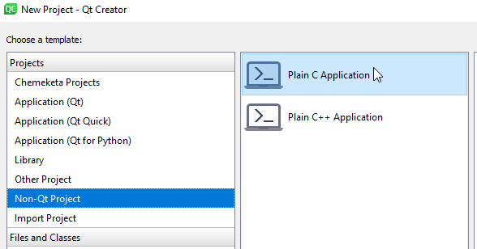

## Learning objectives

Upon finishing this learning module, you should be able to:

* Write programs using arrays to store collections of related information

## Schedule

### Day 1

* No class - if you want to work ahead, work on Day 4 material

### Day 2

* Arrays
* Read Ch 7.1-7.2, 7.4

### Day 3

* Arrays & Functions
* Read Ch7.5-7.8

### Day 4

* Introduction to C - Headers and IO
* See Activity Outline below for details

## Activity Outline

### Arrays

Read Ch 7.1-7.2. These videos covers some of the important (and
sometimes unmentioned) details  




Do the CPPLab Array Basics

Watch the video below and then read Ch 7.4 for various examples of
using arrays.  



Read 7.5-7.8. This video shows some important details of how arrays
work with functions and how to use QtCreator to debug arrays in
functions:  



Do the CPPLab Arrays 2

Start the assignment - you can work on it in parallel with this next
part.

### C based IO

Although C++ shares much with C (most, but not all, C code is valid C++
code), there are significant differences. One of the key differences in
terms of the material we have learned about is how IO is done - there
are no cin and cout. The C tools for doing IO, especially output,
provide some advantages - you will see C++ code that uses the C tools
instead of cout for this reason. You also are likely to be required to
program in C some future course... it is worth becoming familiar with
the basic differences now.

Start by watching this video about C based input/output functions:  



To make a C project in QtCreator, chose the Template **Non-Qt
Project → Plain C Project**  

It will have the proper header for doing IO in C: **\<stdio.h\>**.
If you want to use printf and scanf in a C++ program you would
include that header as **\<cstdio\>**

[This document](https://www3.ntu.edu.sg/home/ehchua/programming/cpp/c1_Basics.html)
has concise examples of using printf and scanf (scroll way down to
sections 3.8 and 3.9. [cplusplus.com has a less friendly but more complete listing](http://www.cplusplus.com/reference/cstdio/printf/)
of printf options.

Do the C IO CPPLab - due Sunday

## Extra Info

### Learncpp.com

This online tutorial covers *some* of the same ground as the readings:  
[LearnCpp.com 9.1-9.3, 9.6](http://www.learncpp.com/)  
