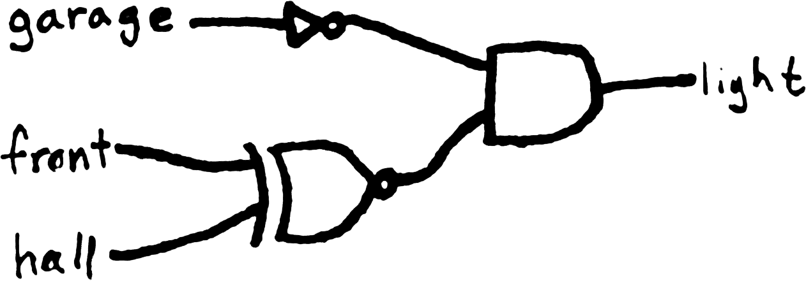

This is a story about light switches and computational thinking.
Lights and switches make great mundane examples of Boolean variables: a
light is on or off, and a switch is up or down. The circuitry in my house
that enables me to control lights with switches, in this perspective,
is computing a Boolean function, where the switches are inputs and the
lights are outputs.

With one switch controlling a light, I argue there is only one reasonable
function to compute. Writing 1 for a switch up or a light on, and 0 for
a switch down or a light off, its truth table is this:

| switch | light |
| --- | --- |
| 0 | 0 |
| 1 | 1 |

That way, the switch controls the light. Technically, this function's
inverse, the NOT function, also works in this way.

| switch | light |
| --- | --- |
| 0 | 0 |
| 1 | 1 |

However, I feel strongly that “down” should correspond to “off”,
so I prefer the first arrangement.

With two switches controlling a light, there are a lot more possibilities.
My childhood bedroom was near the end of a hall, and the hall light could
be controlled by a switch at either end of the hall. For the ability to
talk about them, let's call these switches “A” and “B". The hall
light function was:

| A | B | light |
| --- | --- | --- |
| 0 | 0 | 0 |
| 0 | 1 | 1 |
| 1 | 0 | 1 |
| 1 | 1 | 0 |

You might recognize this as XOR. This is a perfectly reasonable user
experience for light switches. I once rented a house as an adult that
had a similar arrangement, but the inverse function:

| A | B | light |
| --- | --- | --- |
| 0 | 0 | 1 |
| 0 | 1 | 0 |
| 1 | 0 | 0 |
| 1 | 1 | 1 |

This, too, is reasonable, in the sense that [frobnicating] a switch
always changes the light. However, as I mentioned, I have a preference
for the all-switches-down state to leave the light off. Perhaps I feel
too strongly about it, but at any rate, while I admit the utility of
this inverse, I will only ever be truly comfortable with XOR.

  [frobnicating]: http://catb.org/jargon/html/F/frobnicate.html

A different rental house (as a Millennial, I've had to move around a lot
as an adult) had a hall light that computed OR:

| A | B | light |
| --- | --- | --- |
| 0 | 0 | 0 |
| 0 | 1 | 1 |
| 1 | 0 | 1 |
| 1 | 1 | 1 |

This is wrong. Sometimes you have to walk down the hall to use the other
switch because frobbing the one at your end doesn't do anything.

The story so far makes for a pretty useful metaphor, and as a computing
science professor I use it often with my students. One of them told me
about living with two switches that computed AND. We laughed together.

When I moved to my current house in Independence, the story took a turn to
the ludicrous. Here, there is a light controlled by three switches: one
at the front door, one at the door to the garage, and one at the hallway
that leads to the bedrooms. That's fine, because XOR can generalize to
three or any number of switches: the light should be on if an odd number
of switches are up, and off when an even number of switches are up.

However, that is not what these switches did. In fact, I couldn't
easily discern *what* they were doing. I decided to try all the possible
arrangements of switches and write down what the light did in each (this
is what we call a brute force algorithm). I knew immediately that with
2 states for each switch (up or down), and 3 switches, there are $2^3$
or 8 possibilities.  The room is pretty big, and I was going to have
to run all over it flipping switches. Luckily, I thought of Gray code,
which would enable me to go through all 8 possibilities by flipping only
one switch for each, and avoid wasting time visiting the same possibility
twice. Starting with all the switches down, this was my plan:

| garage | front | hall |
| --- | --- | --- |
| 0 | 0 | 0 |
| 0 | 0 | 1 |
| 0 | 1 | 1 |
| 0 | 1 | 0 |
| 1 | 1 | 0 |
| 1 | 1 | 1 |
| 1 | 0 | 1 |
| 1 | 0 | 0 |

This code is cyclic, so at the end I turned off the garage switch and
was back where I started. With all the switches down, the light is on
(and by now you know how I feel about that); by that very light I reviewed
my notes.

| garage | front | hall | light |
| --- | --- | --- | --- |
| 0 | 0 | 0 | 1 |
| 0 | 0 | 1 | 0 |
| 0 | 1 | 1 | 0 |
| 0 | 1 | 0 | 0 |
| 1 | 1 | 0 | 1 |
| 1 | 1 | 1 | 0 |
| 1 | 0 | 1 | 1 |
| 1 | 0 | 0 | 0 |

…what?

I tried rearranging the table in various ways. I tried explaining
the pattern in words. I even tried putting it in a Karnaugh map to
minimize it:

However, I didn't see any opportunities to make blocks any bigger than
1×1.  In information theory, not being able to compress a pattern is
often used as a test that shows it was generated randomly.

So, we had our landlord send around an electrician. He agreed that the
setup was crazy inside, and fixed it for us. After he left, I got out
my notes and went through all the possibilities again, running back and
forth across the room, at first with hope and then with a falling face.

| garage | front | hall | light (before) | light (now)
| --- | --- | --- | --- | --- |
| 0 | 0 | 0 | 1 | 1 |
| 0 | 0 | 1 | 0 | 0 |
| 0 | 1 | 1 | 0 | 1 |
| 0 | 1 | 0 | 0 | 0 |
| 1 | 1 | 0 | 1 | 0 |
| 1 | 1 | 1 | 0 | 0 |
| 1 | 0 | 1 | 1 | 0 |
| 1 | 0 | 0 | 0 | 0 |

At a glance, I can tell that the one by the garage is some kind of kill
switch.  We'll be leaving that one down. If I draw the truth table as
though that switch weren't even a choice, I get this:

| front | hall | light |
| --- | --- | --- |
| 0 | 0 | 1 |
| 0 | 1 | 0 |
| 1 | 0 | 0 |
| 1 | 1 | 1 |

You might recognize this from before. It annoys me that I can't leave
all the switches down when I go to bed, but the electrician did make it
so that frobbing the front door or hall switches at least always changes
the light.

I still don't know what's going on inside my walls, but empirically,
it is equivalent to this Boolean circuit:

I suppose the moral of this story is that computational thinking didn't
actually empower me to solve the problems of living in rental houses,
but it did make facing this silly situation a lot more fun.
