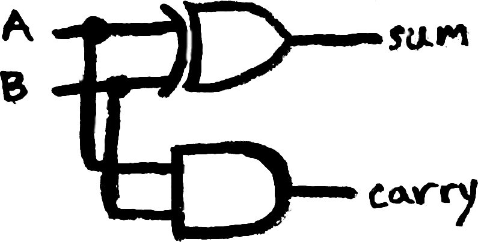
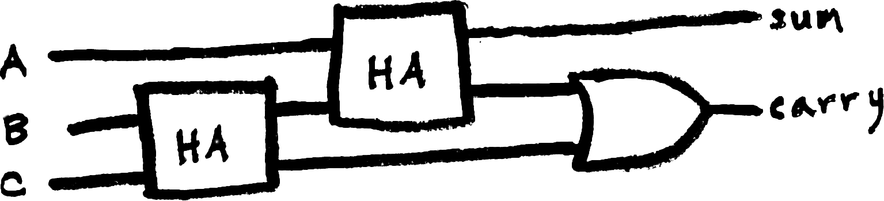
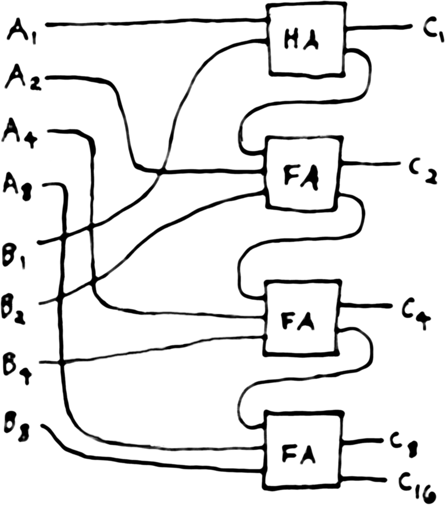
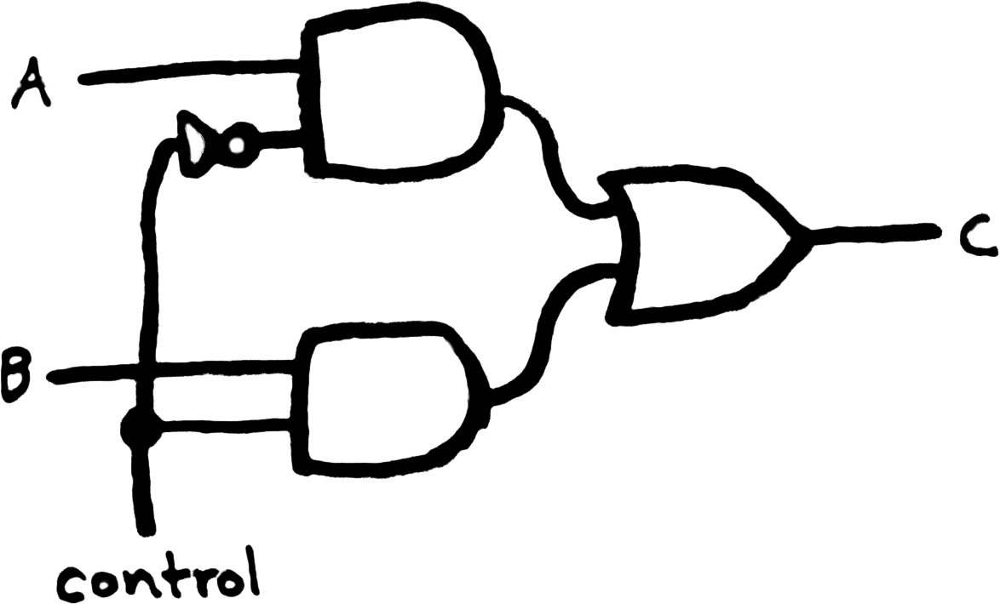
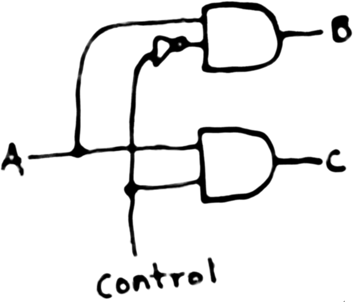

## Learning Objectives

Upon finishing this learning module, you should be able to:

* Describe computer organization, architecture, and systems as interrelated fields of study.
* Work fluently with binary/Boolean values.
* Read circuit diagrams of small combinational circuits.
* Explain how computers perform higher-level operations in terms of lower-level ones.

## Deadlines this week

* Wednesday 11:59pm - Background Survey

## Schedule

### Day 1

* Overview of architecture and its relationship with organization and systems
* Levels of abstraction

### Day 2

* Review of binary arithmetic and Boolean logic
* Start assignment

### Day 3

* Introduction to digital logic
* Combinational circuits
* Binary arithmetic circuits

### Day 4

* Circuit normalization and optimization

## What is architecture?

Computer architecture is about the boundary between hardware and software.
It takes different kinds of work to make good hardware and to make good
software, and people typically specialize on one side of the boundary or
another. However, it is impossible to design really good hardware without
knowing what the software needs to do, and it is impossible to design
really good software without knowing how the hardware will do it.

[Fred Brooks] coined the name “architecture” to describe this
abstraction that connects hardware and software:

  [Fred Brooks]: https://en.wikipedia.org/wiki/Fred_Brooks

> Computer architecture, like other architecture, is the art of
> determining the needs of the user of a structure and then designing to
> meet those needs as effectively as possible within economic and
> technological constraints.

Below the level of the architecture lies the field of computer organization,
which has a focus on the hardware than can achieve the software's goals. Above
the level of the architectures lies the field of computer systems, which is
programming but at the lowest possible level, with the fewest abstractions.
This course will start at the bottom, at the level of individual logic gates,
and work upwards, coming to a conclusion just below the kinds of programming
people typically start with in e.g. CS161. The main thread that links together
this journey will be programming in assembly language.

## Combinational logic

This is the lowest level at which we will explore computing devices.

We are still building on abstractions, but the concrete systems that
implement these abstractions belong to the domain of electrical
engineering, and are outside the scope of this class.

### Basic gates

We will start by reviewing the three most commonly-used logic gates,
AND, OR, and NOT, from the perspective of using them in a circuit
diagram.

An AND gate looks like this:

It has two inputs and one output, which we draw as lines and we can sort
of think of as wires. At any given time, each of these wires is
representing a Boolean value—either true or false. When you connect
wires using an AND gate, it controls the value of its output wire based
on its inputs to match the truth table for AND.

| A | B | output |
| --- | --- | --- |
| 0 | 0 | 0 |
| 0 | 1 | 0 |
| 1 | 0 | 0 |
| 1 | 1 | 1 |

An OR gate is drawn like this:

It connects its two inputs and one output in the same way, controlling
its output to match the truth table for OR.

| A | B | output |
| --- | --- | --- |
| 0 | 0 | 0 |
| 0 | 1 | 1 |
| 1 | 0 | 1 |
| 1 | 1 | 1 |

A NOT gate, or inverter, is drawn like this:

It has just one input and always sets its output to be the opposite of
its input, just like the truth table for NOT.

| A | output |
| --- | --- |
| 0 | 1 |
| 1 | 0 |

The reason for the NOT gate's shape being a triangle with a bubble on
its output is an interesting piece of logic circuit syntax that is worth
knowing about. There is another gate called a buffer that is just drawn
as a triangle with no bubble. A buffer always sets its output to be the
same as its input, so logically, a buffer is useless—electrically
speaking, it does a very important job, but that’s below the level we’re
discussing. Any joint where a wire connects to a gate can be drawn with
a circular bubble, indicating that the value is inverted. So we are
literally drawing a NOT gate as doing the opposite of doing nothing. The
same bubble shows up, for example, in a NAND gate, which is drawn like
this:

A NAND gate is equivalent to an AND gate with its output negated like
this:

When you’re drawing a circuit diagram, a wire can split and carry its
value anywhere you want, but two different wires that are being
controlled as the outputs of different gates cannot be attached
directly. You have to use gates to bring them together.

### Towards numbers

Let’s explore how these simple blocks can be used to implement
recognizable arithmetic. First, we need a multiplication table, just
like the base-10 multiplication table I was drilled in during elementary
school, which laid out all the single-digit products in a big 10×10
grid. Luckily, working in base-2 makes our lives super easy.

<table>
<tr>
<th>×</th>
<th for="col">0</th>
<th for="col">1</th>
</tr>
<tr>
<th for="row">0</th>
<td>0</td>
<td>0</td>
</tr>
<tr>
<th for="row">1</th>
<td>0</td>
<td>1</td>
</tr>
</table>

That's really the whole thing. Now if I reorganize this table into truth
table format, what does it look like?

| A | B | output |
| --- | --- | --- |
| 0 | 0 | 0 |
| 0 | 1 | 0 |
| 1 | 0 | 0 |
| 1 | 1 | 1 |

Multiplication, as long as we stick to 1-bit numbers, is computed by an
AND gate.

Let’s make an addition table.

<table>
<tr>
<th>+</th>
<th for="col">0</th>
<th for="col">1</th>
</tr>
<tr>
<th for="row">0</th>
<td>0</td>
<td>1</td>
</tr>
<tr>
<th for="row">1</th>
<td>1</td>
<td>10</td>
</tr>
</table>

There’s a problem when we get to 1 + 1. There’s no problem writing the
answer in the table; it’s just two, which is written in binary as 10.
But if I try to reorganize it as a truth table, it’s not clear what
should go on the last row, because a wire can’t carry two values.

| A | B | output |
| --- | --- | --- |
| 0 | 0 | 0 |
| 0 | 1 | 1 |
| 1 | 0 | 1 |
| 1 | 1 | ? |

There’s no clear reason to prefer 0 or 1 here, and it turns out they’re
both interesting, useful operations. If we choose 1, we get an OR gate.
If we choose 0, we get an XOR gate, which is drawn like this:

### Addition circuits

In order to make a larger circuit capable of working with base-2 numbers
larger than 1, though, we’re going to need a representation for a value
with multiple place values. We’re just going to run multiple wires in
parallel, keeping track of which one represents which place value. So
let’s re-write this addition truth table respecting that we will need
two places to represent all possible outputs:

| A | B | 2s | 1s |
| --- | --- | --- | --- |
| 0 | 0 | 0 | 0 |
| 0 | 1 | 0 | 1 |
| 1 | 0 | 0 | 1 |
| 1 | 1 | 1 | 0 |

So you can think of the ones place as essentially being the sum that you
would write down as part of your answer in long addition, and the twos
column is also a true/false value telling you whether you have to carry.
If we look at each one separately, what do they look like? The ones
place looks like XOR, and the twos place looks like AND. So, we can
build a circuit that calculates the sum of two 1-bit numbers like this:

This is called a half adder (HA for short). We will get into why it's
called “half” in a moment, but first, we can go up a level of
abstraction by creating a symbol that means half adder.

In general, new kinds of circuits are drawn as labeled rectangles. It's
only the most commonly used, simpler circuits that tend to have their
own special shapes.

What if we want to add bigger numbers?  There are multiple algorithms
for calculating addition. Long addition is one of them, and I’m going
to build on that to show you how we can build a circuit that physically
embodies the algorithm of long addition. Other strategies can be realized
as other circuits, but I think this one is the easiest to explain.

A half-adder is sufficient for calculating the ones place in the long
addition algorithm. But it won’t suffice for the larger place values,
because there might be carry-in. We need a circuit that can add three
1-bit numbers with a 2-bit output. Let’s have a look at its truth table.

| A | B | C | 2s | 1s |
| --- | --- | --- | --- | --- |
| 0 | 0 | 0 | 0 | 0 |
| 0 | 0 | 1 | 0 | 1 |
| 0 | 1 | 0 | 0 | 1 |
| 0 | 1 | 1 | 1 | 0 |
| 1 | 0 | 0 | 0 | 1 |
| 1 | 0 | 1 | 1 | 0 |
| 1 | 1 | 0 | 1 | 0 |
| 1 | 1 | 1 | 1 | 1 |

Take a moment and see if you can use AND, OR, NOT, XOR, and our new tool
the half adder, to build this circuit, which is called a full adder. A
full adder (FA for short) is typically drawn like this.

Inside, you can build it out of half adders like this.

And remember, one level of abstraction lower, that is equivalent to
this.

Now we can line up multiple full adders, just like the way we lined up
the place values in long addition above, and you can literally see where
the wires carry the carry values from place to place. Here’s a circuit
that adds two 4-bit numbers with a 5-bit result. This style of addition
circuit is called a ripple-carry adder.

### Subtraction circuits

We could design a whole new circuit that subtracts. However, since
at least the work of Pascal (who is more famous for e.g. Pascal's law
in physics, but who also built a 17th-century mechanical calculator),
people have used the [method of complements] to perform subtraction
using a machine that can only add.

  [method of complements]: https://en.wikipedia.org/wiki/Method_of_complements

With small modifications, an adder like a ripple-carry adder
can be turned into a controllable circuit that can either add or subtract,
called an [adder-subtractor].

  [adder-subtractor]: https://en.wikipedia.org/wiki/Adder%E2%80%93subtractor

### Multiplication circuits

Some CPUs do not offer multiplication as a basic operation.  Programmers
can work around it by writing software that calculates multiplication with
a loop and repeated addition. Some CPUs appear to offer a multiplication
instruction, but actually take multiple cycles to do the repeated
addition internally; this kind of CPU-internal software-ish trick is
called microcode, and we'll be seeing it again.

It is also possible to make a combinational circuit that calculates
multiplication directly.  We’re not going to delve too deeply into
how a multiplier circuit works, but here you can see [a circuit that embodies
the long multiplication algorithm], similar to how the ripple carry adder
embodies the long addition algorithm.

  [a circuit that embodies the long multiplication algorithm]: http://www.asic-world.com/digital/arithmetic4.html

Here’s another kind of multiplication circuit, for a special case.

It doesn’t even have any gates in it! What does it do?

This circuit multiplies its input by 2. Just like in base-10, where
multiplying by the base itself just shifts a number up and down, in base
2, multiplying by any power of 2 can be done with just shifting. And,
just like people do when they’re doing base-10 arithmetic in their head,
computers frequently exploit this trick in algorithms.

### Conditional circuits

Arithmetic is obviously useful to a programmer, particularly once you
start using numbers to represent other kinds of things. However, you're
not going to get far without being able to make conditional decisions—is
there a circuit version of “if”?

This circuit has two value inputs and a third, control input, and one output. The
control input selects which of the inputs' values goes out the output.

This is a common component, called a multiplexer, or MUX, which is typically
drawn as a trapezoid.

A choice in the opposite direction would take a single value input and
a control input, and decide which of two potential outputs the value is
sent to, while the other remains false.

This circuit is called a demultiplexer, and is drawn respecting its nature
as the opposite of a multiplexer.

### The Arithmetic Logic Unit (ALU)

In CPU design, all of the arithmetic circuits are usually bound up
together in a single package called the Arithmetic Logic Unit (ALU).

(I have never had it disambiguated to my satisfaction whether the Unit is
of both Arithmetic and Logic, or if it is to be thought of as a Unit of
an Arithmetic sort of Logic.  It bothers me because the stress should be
A*rith*metic in the first case, and Arith*met*ic in the second case, so
I don't even know how to pronounce this very important concept. You will
hear both, and it doesn't bother other people as much as it bothers me.)

At any rate, all of the necessary circuits are fed the appropriate
inputs, they all calculate their respective sums, differences, products,
etc., and then a demultiplexer chooses which result to send on. This
might seem strange to a software programmer, where only one branch of
an if/else executes, but it's an important thing to know about logic
circuits. Barring techniques to turn off some parts of the circuitry to
save power, every single gate is constantly computing, no matter whether
it has received meaningful input yet or whether its output will be used.

At this level of circuit diagram, nobody has time to draw lots of little
parallel wires to represent multiple-bit numbers. Particularly when
you're designing a 64-bit architecture, which means most of the values
running around the CPU are actually 64 parallel wires. Instead, it is
common to draw just one line, sometimes bold or with a little note,
that represents an entire bundle of wires. It should be clear from
context how many wires are bundled, and it can seem in such a drawing
that a single line can carry multiple-bit values, but remember that at a
lower level of abstraction it's still just a collection of one-bit wires,
we're just drawing it in an easier way.

Different CPUs will have ALUs that are different and suited to the
architecture, but in general they are drawn like this.

The op or operation or opcode that gets fed in is a control input
that goes to the demultiplexer that decides which operation will be
output. Now we have a calculator.
