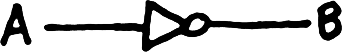
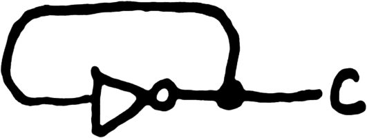
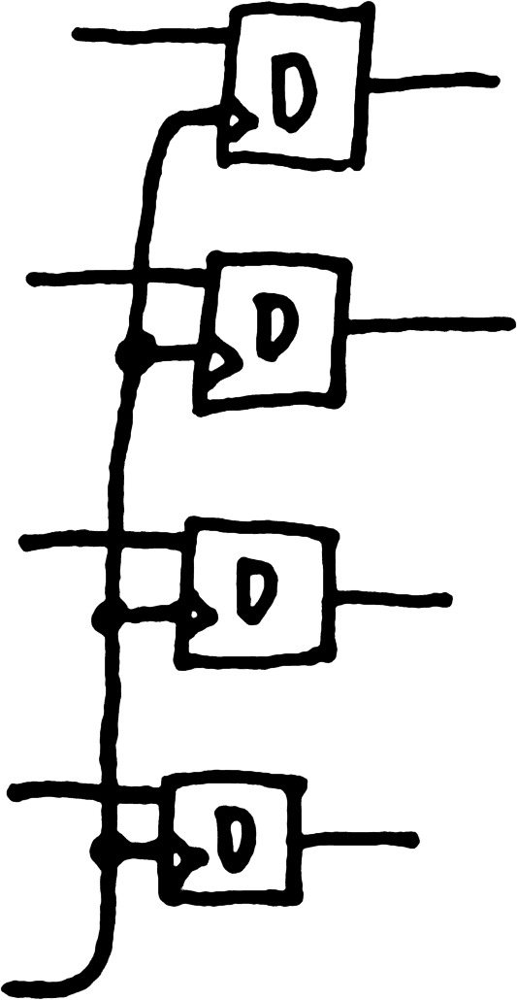
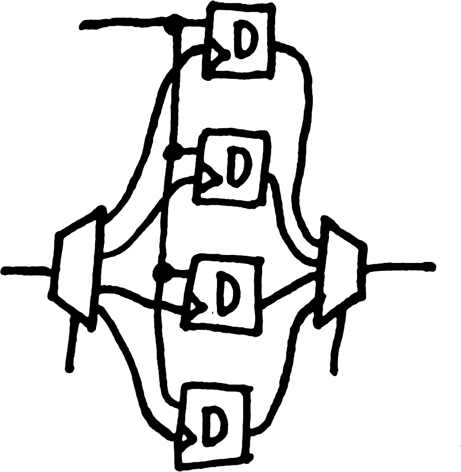

## Learning Objectives

Upon finishing this learning module, you should be able to:

* Distinguish combinational and sequential logic.
* Analyze truth tables of sequential circuits.
* Analyze state machine diagrams.
* Construct memory out of logic gates.

## Deadlines this week

* Monday 11:59pm - Assignment 1

## Sequential logic

### What would happen...

What would happen if we made a loop in a logical circuit? In combinational
logic, channels have a direction, and information always flows away from
the inputs and towards the outputs. That means, based on a particular
assignment of values to the inputs, it is possible to calculate a single,
meaningful value for the outputs (and, indeed, every wire in the circuit)
and write those values in the truth table.

| A | B |
| --- | --- |
| 0 | 1 |
| 1 | 0 |

But what about this?

Recall that all the wires that connect directly at a joint, rather than
through a gate, form a single channel that can only be given a value
as the output of one gate and can have only one value at a time. So by
connecting them in this loop, we have lost both the input A and the output
B—there is now a single channel, which for the sake of distinction I
will call C.

Whenever the NOT gate has its way, it will change C (its output) to be
the opposite of C (also its input). Obviously it is a paradox for C to
be its own opposite in an instant. However, it is true both in practice
and in theory that there is a non-negligible delay while the information
flows from the input of the gate to its output. So, we can distinguish
the version on the input side from the version that will appear on the
output side, which I will denote with a prime mark, as in C′. Now we
can draw the truth table again:

| C | C′ |
| --- | --- |
| 0 | 1 |
| 1 | 0 |

The function of the NOT gate hasn't changed, so apart from the renaming,
this is the same table. However, although a tiny delay allows us to
distinguish C and C′, as soon as the output appears, it will come
back around and become C, and the cycle continues indefinitely, with the
NOT gate flashing the channel on and off as fast as its internal delay
will allow.

Another way to see this is as a state machine. There are two possible
worlds: the one in which C is on, and the one in which C is off. The
action of the NOT gate is not stable in either world, but goes back and
forth between them.

If you can't control the timing, an unstable circuit isn't very useful. If
you can control the timing, however, you have an oscillator, such as
is used to control turn signal blinkers, or to build the clock that
synchronizes components in a CPU. In a logic diagram, a clock is a gate
with one output (and no inputs) drawn like this:

### Using input

Consider this circuit:

Now, rather than a NOT, there is a NOR, and the second input is taken
from somewhere else. This is the truth table:

| A | B | B′ |
| --- | --- | --- |
| 0 | 0 | 1 |
| 0 | 1 | 0 |
| 1 | 0 | 0 |
| 1 | 1 | 0 |

The state machine shows the four possible worlds—each row of the truth
table describes a possible world—and the possible movements between
worlds. The gate cannot affect A, but will set B′ (B for the next cycle)
according to this equation:

B′ = A NOR B

The action of the NOR gate manipulating B will move state to state
following the solid lines. Whoever controls the input A can change it at
any time, which will move from state to state following the dotted lines.

When A is 1 and B is 0, the NOR gate sets B′ to 0, thereby staying in
that state. This state is stable. When A is 1 but B is also 1, the NOR
gate outputs 0, moving immediately to the 10 stable state. When A is 0,
however, this circuit causes B to oscillate 0 and 1, like the unstable
NOT loop.

By itself, this circuit is not of much interest. However, if we could
construct a circuit that had *two* stable states…

### A bistable circuit

This circuit has two inputs, conventionally named S and R, and one
output, conventionally named Q. For the sake of discussion, I will call
the output of the other NOR gate P.

As we will see, this circuit is bistable, meaning it can rest in two
different states. This circuit updates its state based on this pair
of equations:

Q′ = R NOR P  
P′ = S NOR Q

Here is the truth table:

| S | R | P | Q | P′ | Q′ |
| --- | --- | --- | --- | --- | --- |
| 0 | 0 | 0 | 0 | 1 | 1 |
| 0 | 0 | 0 | 1 | 0 | 1 |
| 0 | 0 | 1 | 0 | 1 | 0 |
| 0 | 0 | 1 | 1 | 0 | 0 |
| 0 | 1 | 0 | 0 | 1 | 0 |
| 0 | 1 | 0 | 1 | 0 | 0 |
| 0 | 1 | 1 | 0 | 1 | 0 |
| 0 | 1 | 1 | 1 | 0 | 0 |
| 1 | 0 | 0 | 0 | 0 | 1 |
| 1 | 0 | 0 | 1 | 0 | 1 |
| 1 | 0 | 1 | 0 | 0 | 0 |
| 1 | 0 | 1 | 1 | 0 | 0 |
| 1 | 1 | 0 | 0 | 0 | 0 |
| 1 | 1 | 0 | 1 | 0 | 0 |
| 1 | 1 | 1 | 0 | 0 | 0 |
| 1 | 1 | 1 | 1 | 0 | 0 |

To draw the state machine, I have grouped the 16 possible worlds into 4
groups of 4 based on the states of the inputs. The actions of the NOR
gates move us around within each group. Changing S and R from outside
the circuit moves from a state in one group to the corresponding state
with the same values for P and Q in another group.

When S and R are both off, either of the states in which P and Q are
opposites is stable (if P and Q are the same, there is an unstable
oscillation, but in the normal use of this circuit, we stay out of
that situation). When R is on, but S isn't, the state where Q is off
(and P is its opposite) is stable, and every other state eventually
lands there. When S is on, and R isn't, the state where Q is on (and
P is its opposite) is stable, and every other state eventually lands
there. So, briefly holding S on turns P on, and returning to S and R
both off holds in that state. Using R the same way holds in the state
where P is off. This is memory! You can Set P to 1 using S and Reset it
to 0 using R, hence their names. The circuit is called an SR Latch,
for Set–Reset latch.

(I haven't described what happens if S and R are on at the same time.
In correct operation of an SR Latch, you are not allowed to set them
both at the same time. You might take a moment to figure out what would
go wrong if you did, and how you might recover from it.)

### Saving a calculation

More often than knowing that you want to set or reset a bit is the
situation in which you have a wire that has calculated a bit, either zero
or one, and either way you want to remember it for later. The component
you would use in that situation is called a D Latch. Instead of Set and
Reset inputs, it has a Data input (D) representing the information to be
saved, and an Enable input (E) indicating when to save it. When E is on,
the D Latch is transparent; the D input flows straight through to the Q
output and changes in D are reflected in Q as rapidly as the information
can flow through the circuit. When E turns off, the value of D at that
moment is latched in place, and Q remembers that value (regardless of what
happens to D, as long as E is off).

Think for a moment how you could adapt what you know about the SR latch
to present this different interface. Here is one way to make a D Latch
by adapting the inputs of an SR Latch:

### Synchronizing memory with other components

The two kinds of logic circuits are combinational logic, which calculates
functions, and sequential logic, which can be used to implement
memory. The most common way to design computational circuits is through
stages or loops of alternating combinational logic to calculate the
values and sequential logic to store them, followed by combinational
logic to calculate further information based on those values, and further
sequential logic to store those results, and so on.

Thus, it is important to be able to use sequential logic to synchronize
between stages of computation. Latches don't do that, because data flows
through them immediately as long as they are enabled. By connecting two
D latches as follows, it is possible to create a form of memory that
transitions instantaneously from an old value to a new value.

This is called a D Flip-Flop, which saves the value of D whenever its
clock input goes from low to high, and then does not change its output
again until the next clock cycle, leaving the combinational logic upstream
of it to calculate a new result without disrupting the calculations that
are proceeding based on the saved result.

There are a variety of latches and flip-flops, from SR and D to T and JK,
all of which store one bit of information, with different interfaces to
changing what is stored.

### More memory

A computer has more than one bit of memory. There are two ways we need
to expand from our basic flip flop to store more information. The first
is to store a value that is multiple bits wide. The second is to store
multiple separate values.

A register is memory inside a CPU that stores a single value. That value
can be of whatever width in bits the CPU needs to store. To store a 4-bit
value, we can imagine that we will need 4 flip-flops, and a bundle of
4 parallel wires representing the value. It is worth taking a moment
on your own to think about how to wire up the inputs, flip-flops, and
clock so that the circuit functions like a single 4-bit-wide value.

Each bit of the input is matched with one of the 1-bit memories and
they all share the clock signal, so they transition as one. Any number
of flip-flops could be wired up this way to make any size of register.

Random-Access Memory (RAM) is memory that stores multiple values, and
which allows reading and writing directly to each value. In addition to
the separate component called RAM, the same access pattern is often seen
in a component on the CPU itself called the register file. Rather than
wiring up 4 flip-flops to store a single, 4-bit value as we just did,
think about how to wire them up to store four 1-bit values that can be
controlled individually.

First, we will need a way to specify which of the bits to control. We can
use a demultiplexer to direct a signal to only one of the flip-flops.
How many bits will the demultiplexer need to pick out a particular one
of them? Because $log_2(4)=2$ we know it will take 2 bits. Supplying
the control input 00 will select the first flip-flop, 01 will select
the second flip-flop, 10 will select the third flip-flop, and 11 will
select the fourth flip-flop.  The code corresponding to each flip-flop
is called its address. If you think of the row of flip-flops as being
like an array, and you read the code as a number, that number is like
the index into the array.

Think about how to wire up 4 flip-flops for random access and then look
at the following figure.

Instead of a data input for each flip-flop, there is only one.  Instead of
the clock being copied to all of the flip-flops, it is that single data
input that is copied to all of them; however, all but one of them will
ignore that input as the clock is demultiplexed to only the location
specified by the address input. (If you wanted to choose whether to write
anything at all, think about what you would add.)

On the output side, a multiplexer chooses which flip-flop's value to send out.
If the DEMUX and MUX use the same address, this whole circuit
behaves like a single flip-flop at a time, but changing the address will shift
to different locations in memory. If the DEMUX and MUX have independence
addresses, you can write to one location while reading from another. It is
often useful in CPU design to be able to write to one location and read from
two others at once (think about how you could accommodate that).

The two strategies used to make wider memory (as in the register) and
more locations in memory (as in the RAM) can be combined to create memory
that has any number of locations (although powers of 2 will be the most
convenient sizes) and any number of bits in each location.

In machine code and in higher-level programming languages, the smallest
addressable unit of computer memory is typically the byte. However, at
the hardware level, it is normal for the bus connecting the CPU to the
RAM to be multiple bytes wide so that even if a program refers to just
one byte, a whole bus-line amount of information will be moved between
the RAM and the CPU. This size typically appears in multiple places
throughout the architecture, and is called the architecture's word
size. A word is the actual smallest amount of information that can be
conveniently operated on at the hardware level. The computer I'm writing
this on has a 64-bit architecture, meaning that its word size is 64 bits
(8 bytes). Around the turn of the millennium, it was more common for a
comparable system to have a 32-bit word size. The style of art called
“8-bit” is named after the art appearing in games systems such as the
original Nintendo and Atari, which had 8-bit architectures.
