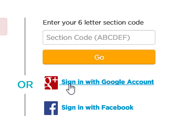
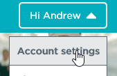
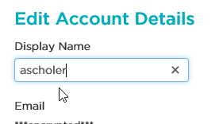
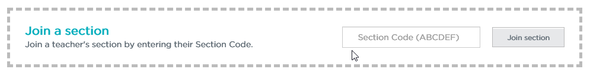
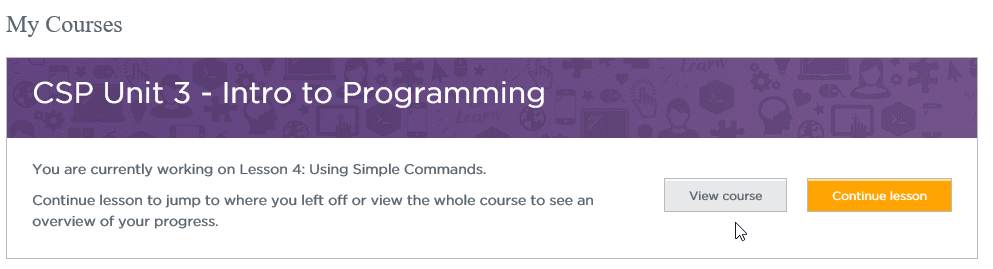
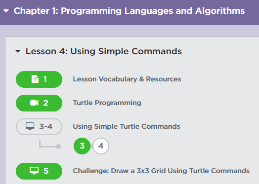

Code.org studio is an environment for learning about programming that we will use in this course. In order to do the tutorials from Code.org’s Code Studio, you will need to do the following:

Go to https://studio.code.org/home and use the Sign in with Google Account and your my.chemeketa.edu sign in (or if you prefer, you can make an account using some other email).

Once you are logged in, go to the Account Settings:

Change your Display Name to match your Chemeketa username. (If you are “ascholer\@my.chemeketa.edu”, you should use “ascholer” as your display name). Hit the Update button once you change your name.

{}
If you do not set your display name correctly, you will not receive credit for completing activities in Code Studio.
{}

Back at your [home](https://studio.code.org/home), scroll to the bottom of the page and find the Join Section tool. 

Enter the six-letter section code from the syllabus, then hit Join.

Now on your homepage you should see “My Courses” and a link to the course:

Each week, there will be instructions about which chapters and lessons to complete from Code.org. (Week one is Unit 3, Ch 1, Lesson 4, parts 2-5 which are shown below).

As you complete activities, they will turn green.

