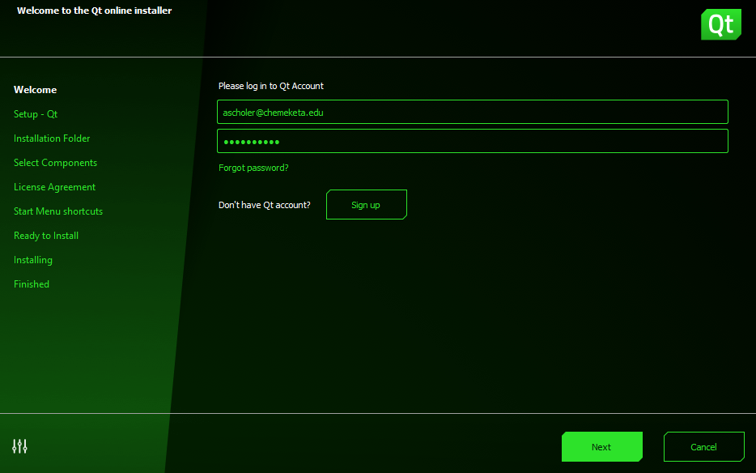
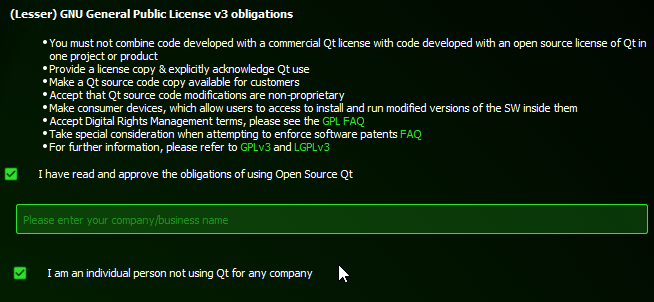
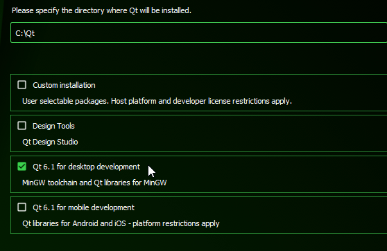
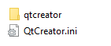
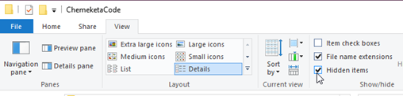
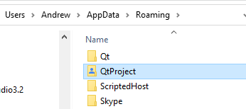
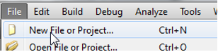
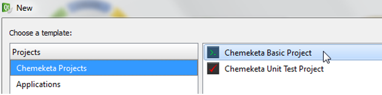
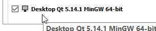
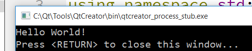

{}
QT changes their webpage frequently and releases updates to QTCreator. If what you see does not
exactly match the screenshots below, do your best to select similar options.
{}

## Requirements

1. You must have a fairly up to date version of your operating system (Windows, MacOS, or Linux).
1. You will need to download multiple gigabytes of data. If you do not have fast internet service at
home, and have a laptop, consider trying to do the installation at a library.

## Prep

If you are on Mac or Linux, you need to do some quick setup:

### Mac

You will need to install **XCode** (Apple's development tool) before installing QT. Find and install
it on the app store.

### Linux

Linux you may need to install other packages first. You need gcc, cmake and gdb for Ubuntu
and other apt based distros you can try installing build-essential, gdb and cmake like this:

    sudo apt-get install build-essential
    sudo apt-get install gdb
    sudo apt-get install cmake

If while installing you get errors about not being able to find -lGL you will need:

    sudo apt-get install libglu1-mesa-dev

## Download

Go to [https://www.qt.io/download](https://www.qt.io/download)

You want the Open source version:

On the following page, scroll down to the bottom to download the online installer:

## Installation

Launch the QT Online installer. Continue until you get to the account screen. If this
is your first install, you will need to make a new Qt Account to download the software.

Acknowledge the Open Source License:

Then continue until you get to the **Installation Folder** screen. On it, select **Default desktop installation**:

## QTProject Template Setup

QTCreator stores its preferences in a folder called **QTProject**.  To install the Chemeketa project templates and set some important preferences, grab this compressed QTProject folder:
[https://computerscience.chemeketa.edu/CSResources/QtCreator/QtProject.zip](https://computerscience.chemeketa.edu/CSResources/QtCreator/QtProject.zip)

Then unzip the folder. You should end up with a folder called **QtProject** with this inside it:

(There should NOT be a second folder called QtProject inside the first one. If there is,
ignore the outer QtProject folder and use the inner one that actually contains QtCreator.ini
and qtcreator.)

We need to move the **QtProject** folder to the location that QTCreator will look for it.
Directions vary by platform:

### Windows

The QTProject folder needs to be placed in the directory:

    C:\Users\YOUR_NAME\AppData\Roaming

To find this folder, you need to enable viewing of hidden items:

Then you should be able to navigate from C: to Users to YOUR_NAME to AppData then Roaming.
Move or Copy the QTProject folder there:

### Mac / Linux

The QTProject folder needs to be placed in the directory:

    ~/.config/

This is a hidden folder named **.config** in your home directory (**~/** is your home directory).
You can get there on Mac using ``Command+Shift+G`` and typing ``~/.config/`` as the destination.

The **.config** folder may or may not already exist. If you are told that folder does not exist,
you will have to create it. Open a Terminal window. Type the following two commands into it:

    cd ~/
    mkdir .config

The first makes sure you are in your home directory (cd: change directory).
The second one makes a new folder (directory) called **.config.**

Place the QtProject folder inside this **.config** folder.

## Testing the Project Template

Once you install the QTProject folder, start QTCreator and do the following to confirm your setup:

1. Create a New Project: 

1. You should see **Chemeketa Projects** as an option:

If you do not see the Chemeketa Project templates, the most likely problem is that your QTProject folder
is in the wrong location. When you start QTCreator, if it cannot find a QTProject folder it will
make one. Look for this folder and replace it with the provided one.

1. Select **Chemeketa Basic Project**

1. Click Next until you get to Kit Selection. Make sure at least one kit is selected.
If you are on Windows, you should make sure that it is the MinGW kit:

If Next button is grayed out on the Kit Selection Screen. screen, then you most likely
did not install the compiler (MinGW on Windows, Xcode on Mac). If on a Mac, make sure
Xcode is installed and then reinstall QT. If on Windows, rerun the installer and make sure
MinGW is selected in two locations.

1. You now should be looking at code that shows "Hello World". Build the code with **Build > Build Project**
menu item (or ``ctrl-B``). Then run the program with **Build > Run** (or ``ctrl-R``).

1. A window should appear that displays the text ``Hello World!``. (If you are on a mac it will
display some other text as well - you can ignore the other text.)
